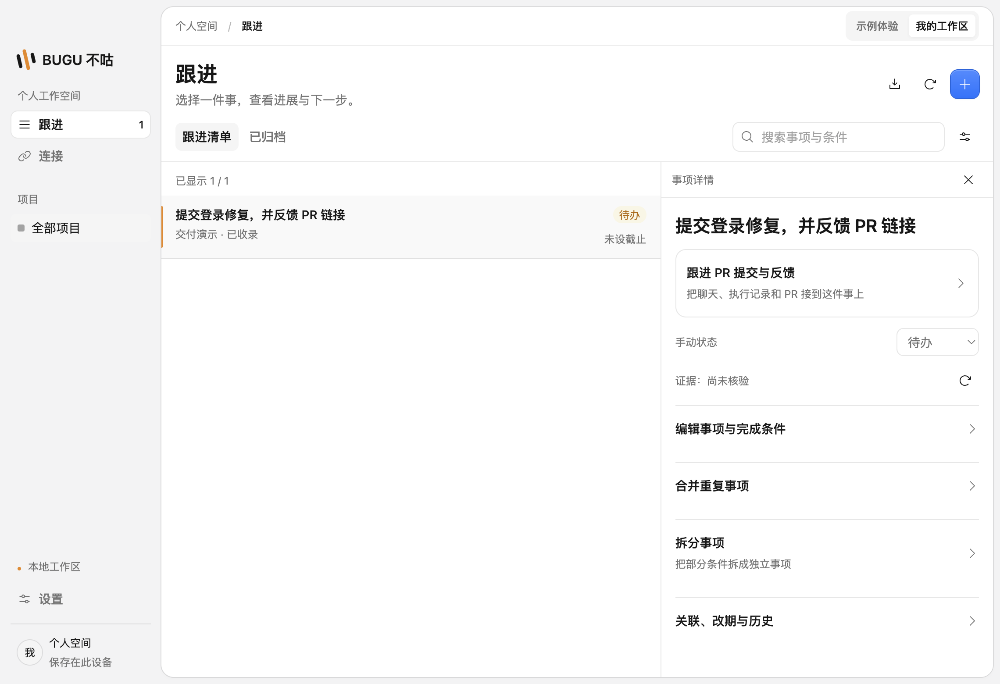
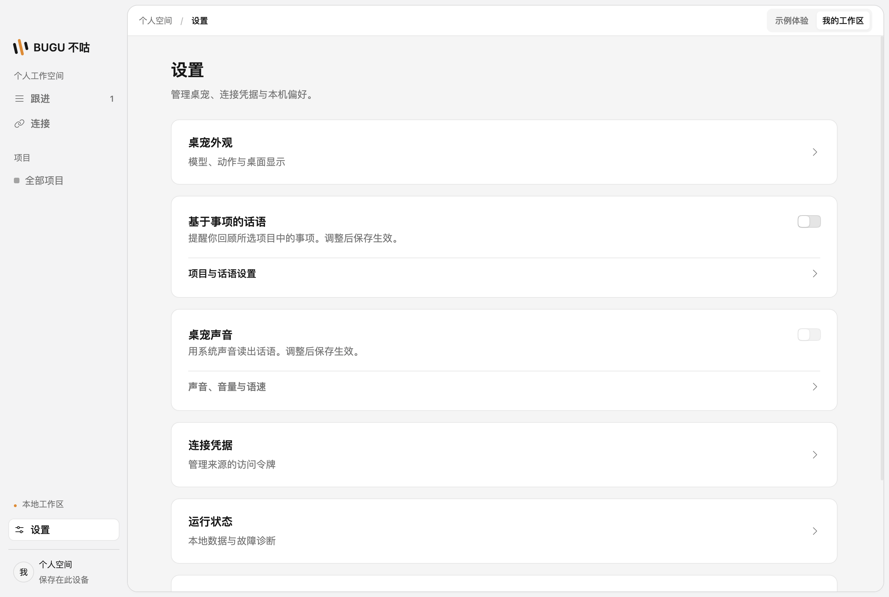

# 工作区与设置页减法

本批参考用户提供的 Cloudflare 控制台截图，保留灰色侧栏和右侧白色圆角工作区，以信息层级和渐进展开减少常驻控件。

- 跟进页只保留标题、清单/归档切换、搜索与操作图标。创建项目和事项移入弹窗，Escape 关闭后回到入口，关闭保留未提交标题草稿。
- 项目、状态、收录、来源、活跃度筛选按需展开。收起后仍显示已启用数量及条件摘要，可清除；Escape 收起后焦点回到筛选入口。
- 刷新、导出、新建、筛选、关闭和标题/日期保存使用统一图标按钮。32px 点击区域、16px 图标，Kumo Tooltip 在悬停和键盘聚焦时说明用途，按钮保留可访问名称。
- 事项详情保留交付进展与状态；标题、截止时间和条件编辑默认折叠。窄窗口查看详情时暂时隐藏列表，关闭即可返回，详情占满可用宽度。
- 设置页采用单功能卡片，卡片间隔16px、内部20–24px，标题16px、说明14px。事项话语和声音使用右侧 Kumo Switch，项目/声音参数默认折叠；未修改且未启用时不显示无用的保存/预览按钮。
- 自动话语开关沿用即时保存；事项话语和声音开关仍是待保存的设置草稿，界面提示保存后生效。未改变默认授权或后台行为。

验证使用隔离合成数据，覆盖宽窄窗口、按钮图标水平/垂直居中、hover/focus 提示、弹窗和筛选的 Escape/焦点恢复，以及事项编辑、交付、拆分、草稿保留、来源引用、改期、提醒与声音设置。只运行受影响 E2E，不恢复 CI。

## 实机预览

以下使用隔离的合成事项数据。

[窄窗口跟进页](previews/simple-workspace-narrow.png) · [窄窗口设置页](previews/simple-settings-narrow.png)
