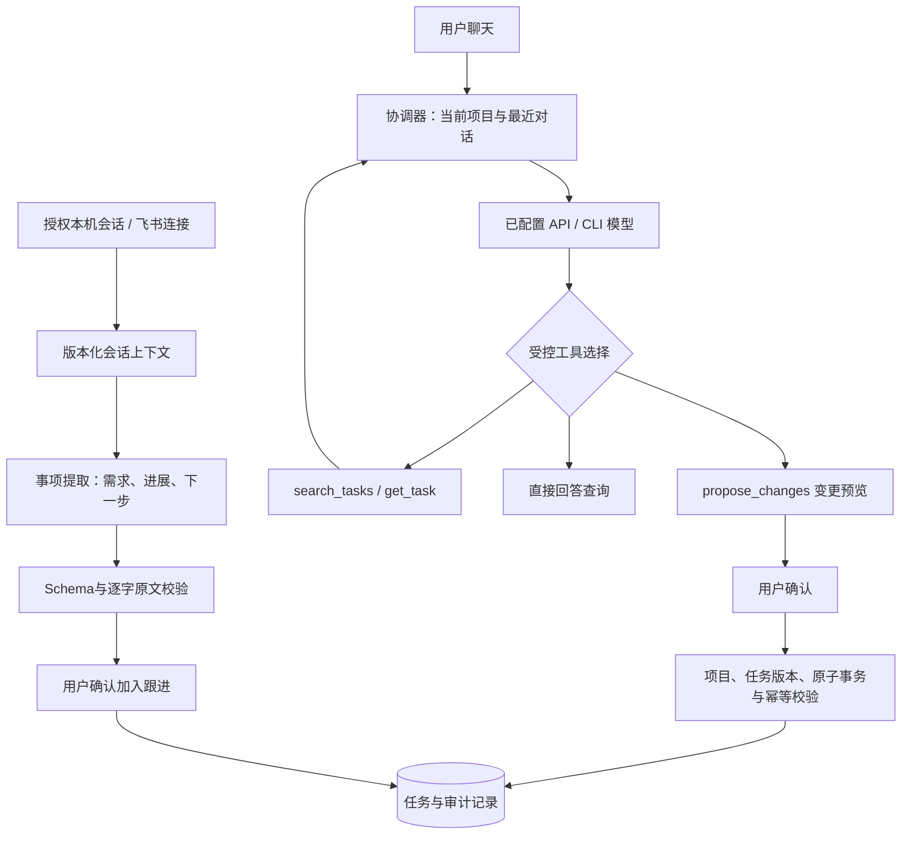
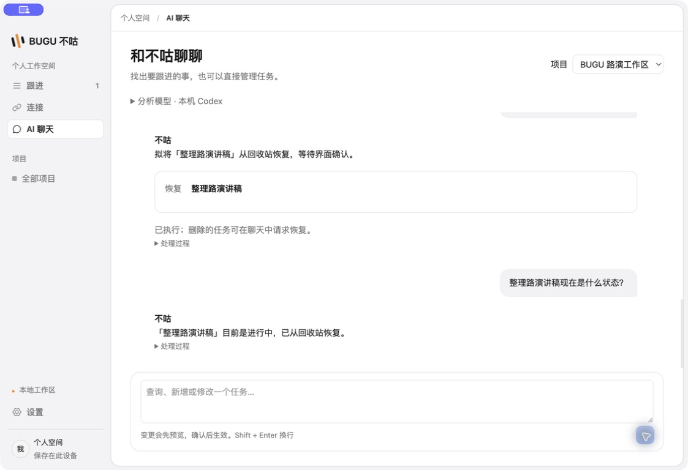

# BUGU Agent 编排与任务聊天

目标是把授权会话和飞书交流提取成可核对的具体任务，并让用户在软件内用自然语言查询、新增、修改、删除和恢复任务。

## 实现结构

参考本机 AstrBot `/Users/xiangyang/Documents/GitHub/AstrBot-fix-10024`，提交 `1f1d795eb902a0f92a107dc6b39ef0ca5922af65` 的 `agent/runners/base.py`、`tool_loop_agent_runner.py`、`tool_executor.py` 与上下文结构。借鉴分步 Runner、工具执行器、运行状态和步数限制的设计，以 TypeScript 重新实现 BUGU 的受控任务编排；未复制 AstrBot 源码、未捆绑 Python 运行时或改变其许可证。

协调器最多运行 4 步，查询工具只读当前项目。传给模型的业务工具由宿主执行，而非让 Codex/Claude CLI 获得系统工具权限。工具结果交回模型继续处理；这不是硬编码关键词替代模型理解，也不是通用自主执行平台。

查询在当前项目全部任务中按标题检索，单次最多返回 100 项，并明确有限结果；聊天使用最近 8 轮上下文。不会把有限返回声称为所有项目的完整任务清单。自然语言指代和语义检索依赖模型及标题查询，复杂模糊指代应要求澄清。

## 聊天产品流程

左侧「AI 聊天」，顶部选择项目；模型设置默认收起，与连接页使用同一个配置。

- 查询：“有哪些任务还没完成？”、“查一下路演材料”。
- 新增：“新增准备路演材料，不设置截止”。
- 修改：“将准备路演材料改为整理路演讲稿，状态改成进行中”。
- 删除：“删除整理路演讲稿”。预览显示“移入回收站”，确认后隐藏于常规任务列表。
- 恢复：“恢复回收站里的整理路演讲稿”。保留业务状态和证据，恢复原先的收录与归档状态。

写操作展示目标任务及将变更的字段，点击确认后才提交。批量确认采用单个事务；任一目标过期或不合法则全部回滚。重复确认不重复新增。删除单独记入回收站，不等同于业务完成或普通归档；仍保留任务数据和人工审计。

每轮聊天持久保存问题、回复、提案、执行状态、模型身份与简要轨迹。重启中断的运行明确失败，不会偷偷重放写操作。支持停止生成、放弃提案；运行轨迹按需展开。

## 来源提取

「连接 → AI事项分析」可以选择本机已授权会话或已同步的飞书连接。飞书上下文检查 `feishu_connections` 的授权版本、enabled、revoked；暂停、撤权或上下文更新后旧结果不能提交。用户和机器人角色沿用连接器映射，不把机器人声称交付等同于人类验收。

当前是用户选择单个来源后主动分析。自动多源扫描、跨来源推理归并、完整 DAG 并发编排及崩溃后续跑不在本轮完成范围；只实现恢复为可见中断状态。飞书真实租户调用仍沿用既有授权连接，本次验证使用隔离虚构样例。

## 数据与验证

SQLite v24 新增 `agent_chat_runs` 和 `agent_task_trash`。renderer 只有类型化 `chat.*` 桥；主进程依据固定用途选择输出 Schema，Core 拒绝未见过的任务 ID，确认时重验项目与任务版本。API Key 不进入聊天消息和工具输出。模型配置默认关闭，启用后才调用所选远端服务或 CLI 的模型额度。

相关验证：工具协议、真实查询结果回传、循环上限、取消；SQLite 的 CRUD/回收站恢复、重复确认、跨项目拒绝、人工版本冲突、事务回滚、重启；飞书暂停/撤权/重新授权后的过期建议拒绝。E2E 仅跑受影响入口和聊天故障提示，不恢复全量 CI。

## 实机验收（2026-09-14）

在隔离的路演工作区，通过 BUGU 界面调用本机 Codex 的真实模型，依次完成新增「准备路演材料」、改名「整理路演讲稿」并改为进行中、移入回收站、恢复、查询状态。四次变更均经过界面确认；最后模型查询返回进行中，恢复未丢失状态。未读取或修改本人工作区。

验证通过：35 项相关单元测试、任务聊天/来源分析/任务模型 3 组存储集成测试、1 项受影响桌面 E2E，以及类型检查、分层检查与构建。存储回归包含 v2/v3 旧数据库升级到 v24。
