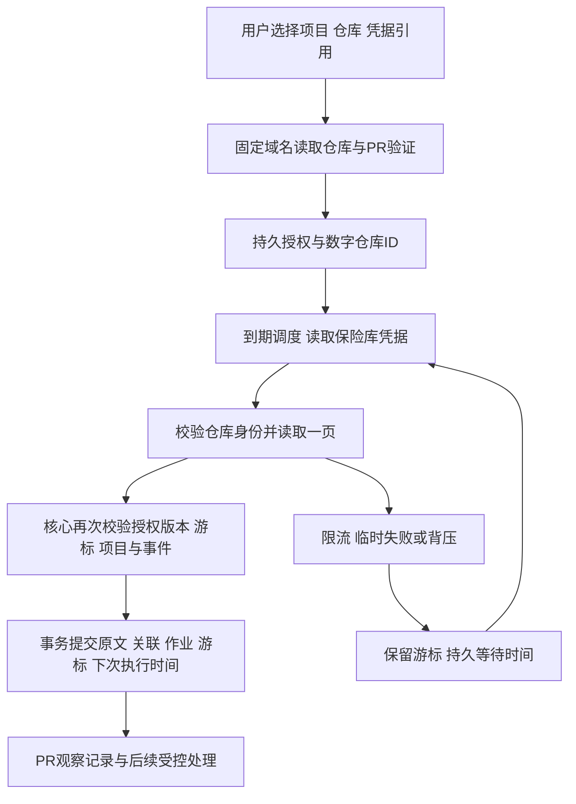
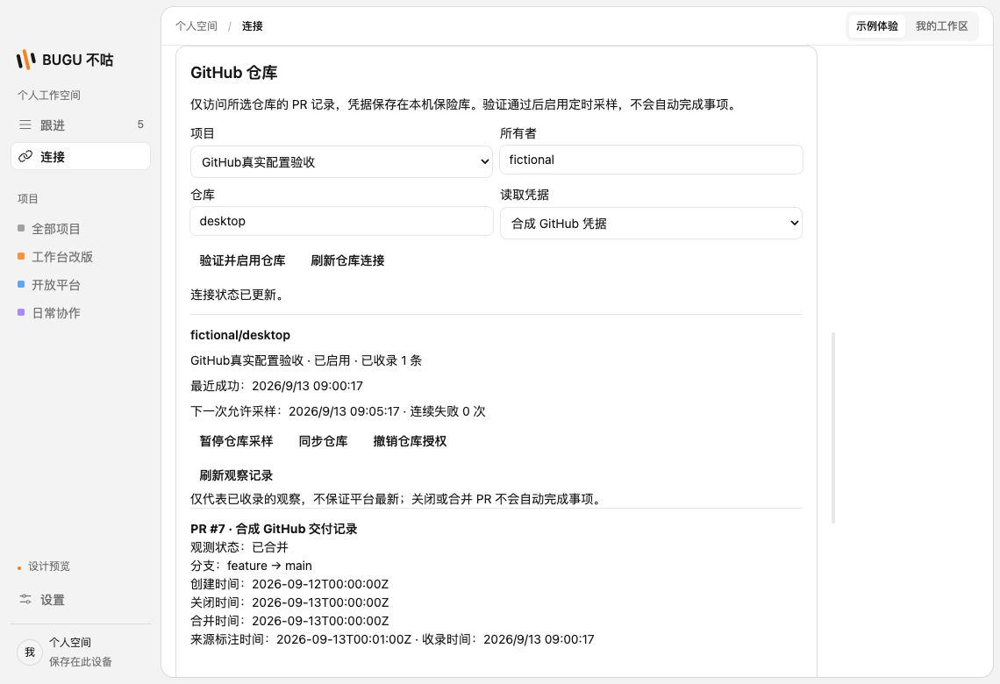
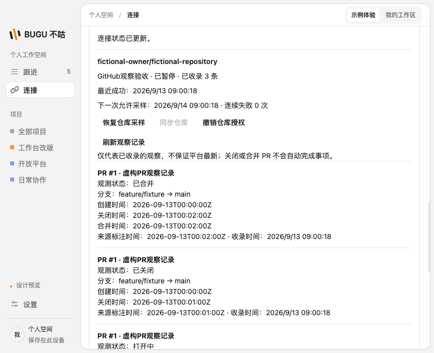

# GitHub 专用连接与持久采集

## 用户流程

在连接页选择项目，填写仓库拥有者和仓库名，并选择保险库中 `api.github.com`、用途为来源读取的凭据。点击“验证并启用”后，宿主验证仓库和 PR 读取权限，再保存该范围的授权。应用不内置共享 client secret，界面和数据库只保存凭据引用。

建议使用限定所选仓库的 fine-grained PAT，授予 Pull requests 读取权限；该权限要求来自 [GitHub PR API](https://docs.github.com/en/rest/pulls/pulls#list-pull-requests)。这是一种令牌接入方式，尚不是 OAuth 设备授权或自动刷新流程。

连接显示最近成功时间、下一次同步时间、错误与已收录数量。可暂停、恢复或撤销。已收录 PR 以观察记录展示打开、关闭、合并状态和分支，保留不同修订；收录顺序不等于平台版本顺序，合并不会自动把用户事项改成完成。

## 数据流

SQLite v12 为专用 GitHub 连接保存项目、仓库名称和数字 ID、凭据引用、授权版本、启停状态、分页游标、下一次执行时间、失败次数及最后成功时间。独立的采集版本号随成功或失败递增，防止每轮结束的空游标产生重复提交；按凭据保存的冷却状态也覆盖首次连接验证。暂停、恢复和撤销变更授权版本；提交再次比较版本和原游标，拒绝旧请求晚到。

仓库名可能被更名或重新使用，因此仅匹配字符串不够。[仓库读取接口](https://docs.github.com/en/rest/repos/repos#get-a-repository) 用于校验数字身份，空 PR 仓库同样校验。PR 的 base 仓库也必须匹配授权范围；错误仓库不得进入当前项目。

每次调度只收录一页，尾页完成后安排下一轮从首页重扫。页码不是远端快照；重复依靠不可变事件身份去重，分页期间远端变化只能在后续扫描中补齐，不能声称一次扫描代表完整事务快照。

## 限流、凭据与异常

下一次执行时间持久保存，手动同步和暂停后恢复都不能绕过限流。遵守 Retry-After 和剩余限额重置时间；显式二级限流至少等待一分钟，连续失败退避。权限不足与限流分别展示，不把所有 403 都当成限流。依据见 [GitHub 限流说明](https://docs.github.com/en/rest/using-the-rest-api/rate-limits-for-the-rest-api)。

每次实际请求从保险库读取凭据，条件响应缓存按凭据指纹隔离。运行时最多缓存 32 个已授权读取器，真正复用跨轮 ETag；授权版本变化、取消或删除凭据会清理缓存。删除凭据时取消在途请求并暂停匹配连接。应用退出取消调度；重启恢复数据库中的等待时间和游标。临时失败与收录背压不会把已有记录误判为无效，也不会让待处理队列因为采集错误而无法排空。

## 验证与边界

本批使用隔离凭据和合成 PR，测试实际宿主、核心、SQLite 和界面链路；不读取用户真实聊天或私人仓库。生产网络仍使用已有的受限 HTTPS 传输，不提供任意地址、重定向或渲染进程原始网络能力。

最终 `pnpm check` 通过：包边界、TypeScript、1,283 个单元测试、构建、15 组 SQLite 集成、26 条桌面测试通过，2 条既有专项跳过。新增完整表单流程使用真实保险库、主进程、HTTPS 响应处理、核心和数据库，仅在测试进程替换 OS DNS/TLS 边界；另一个隔离预置测试覆盖观察历史和暂停/撤销管理。运行时验证跨轮 200→304、凭据轮换、持久冷却、共享凭据等待、双版本重复提交拒绝、取消与删除竞争；存储验证仓库/项目隔离、背压回滚、重启、引用失效与 512KiB 记录分页。宽窄截图已查看。

## 界面记录

