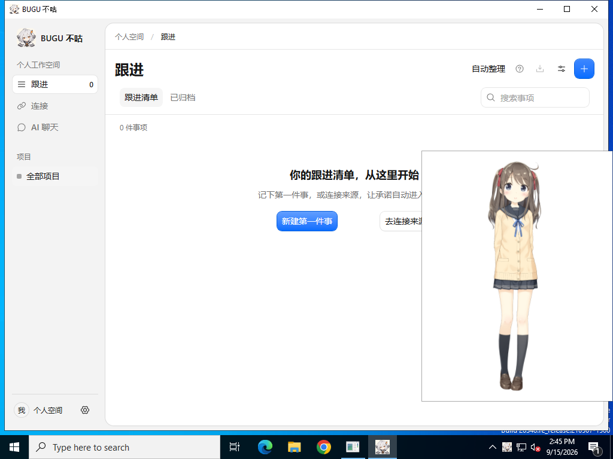

# Windows v0.1.1 安装包启动验收

结论：在干净的 GitHub Windows Server 2022 x64 环境中，已发布的 v0.1.1 安装程序可以完成安装、普通启动和主界面加载；SQLite、默认 Hiyori 渲染、项目写入及退出重开均通过。**尚未复现组员机器上的启动失败，不能把本轮测试说成已修复该故障。**

## 实际对象与结果

本轮直接下载 GitHub Release 的 `BUGU-0.1.1-Windows-x64-Setup.exe`，没有用源码开发窗口或新编译的包代替。安装文件 SHA-256 与已发布的 SHA256SUMS 一致：

`8851399ad396b14e9959e7d2c4fc42c488170e804940d3c5d811789b1178c438`

- 目标代码：v0.1.1 → main `ba5c3a01fbddef3983d162b33c91daf33c798ced`。
- 系统：Windows Server 2022 Datacenter，10.0.20348，64 位。
- 安装到包含中文与空格的目录，NSIS 返回 0。
- 先不加调试器普通启动，12 秒后进程仍在，截图包含主窗口和默认桌宠。
- 再用 Playwright 启动安装后的 exe，确认 `app.isPackaged=true`、版本 0.1.1、win32/x64。
- 主页面 `memo://app/index.html` 正常；preload 不暴露 Node；SQLite v25 ready，首次零项目/零事件，模型默认关闭。
- 创建一个隔离测试项目；连接页、设置页正常；内置模型只有 Hiyori，手动显示后等待 renderStatus=ready 并截图。
- 退出并重新打开，项目仍存在。

[成功运行](https://github.com/bread-ovO/bugu-notes/actions/runs/34983686622)；[完整机器结果](../evals/results/windows-startup-v0.1.1/report.json)。界面截图和普通启动信息一并保存在[证据目录](../evals/results/windows-startup-v0.1.1/)。

首轮已通过主窗口、数据库与初始项目检查，但测试假定第二次启动必定自动显示桌宠，导致脚本失败；实际产品只在首次初始化时自动显示。本轮改为显式显示并等待渲染就绪，[原始失败记录](../evals/results/windows-startup-v0.1.1/initial-test-assumption-failure.json)保留。没有为使测试通过修改产品行为。

## 重复运行

Release installers 工作流新增可选输入 `verify_windows_release`。填写后只对该已发布版本做 Windows 安装启动验证，跳过三平台构建与发布；普通 tag 发布和默认手动构建仍沿用原流程。不添加普通提交/PR 的全量 CI。

```sh
gh workflow run release.yml --repo bread-ovO/bugu-notes \
  --ref xiangyang/windows-startup-verification \
  -f tag=v0.1.1 -f verify_windows_release=v0.1.1
```

合入后 `--ref` 可改为 main。脚本只能在 GitHub 的 Windows 临时 runner 执行，不作用于开发者真实个人工作区。当前验证步骤并未自动嵌入每次 tag 构建，需手动选择验证已发布版本。

## 仍需定位的组员问题

需提供安装包版本、Windows 版本/架构和失败表现（安装失败、无反应、报错退出或白屏），如有对话框保留报错原文。此测试没有覆盖用户机器的现有配置、杀毒/应用控制策略、下载来源标记、显卡驱动，也没有模拟所有 Win10/Win11/ARM 环境。诊断结果只能证明该固定发布包在记录的环境中可运行。


