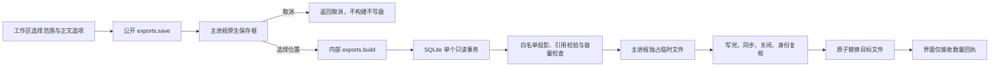

# Q04 事项与证据导出

真实工作区的「导出」入口保存版本化 JSON 文件。可选择一个项目全部事项（包括归档、忽略和候选）或当前选中事项。导出范围不受列表搜索、分页及状态筛选影响；未分配项目的旧事项需先分配项目。

默认只导出引用定位，不带事件正文。用户可勾选包含已保存在本机的引用原文。生成文件是明文，正文不会自动脱敏；不会导出应用保存的连接凭据、授权路径、游标、作业、检索索引或内部 outbox。

## 文件内容与语义

`schemaVersion: 1` 是导出格式版本，与数据库迁移版本独立。文件包含导出时间、项目、导出范围（全项目或所选 ID）、正文选项，以及以下集合：

| 集合 | 内容 |
| --- | --- |
| tasks | 标题、归属、负责人、截止时间、业务/证据/收录状态、归档时间和三个版本号 |
| criteriaSets | 全部条件版本，包括空集合；标记是否为当前版本 |
| evidence | 支持、反对、相关关系，原有有效性及原因，标记是否属于当前条件 |
| decisions | 完整人工决定、理由、输入引用、版本、替代关系及受控变更内容 |
| revisions | 完整事项修订；旧快照缺少截止时间字段时保留历史事实 |
| manualOverrides | 人工覆盖范围及对应决定 |
| events | 仅上述记录直接引用的事件；包含稳定 ID、修订、角色、时间和采集授权状态，可选正文 |

历史、未知和失效证据保留原状态，不伪装成当前有效证据。有效反证也会导出。人工完成不会把未知证据改成充分。撤销采集授权不删除已存事件，导出标明已撤权且不重新读取源文件。当前尚未实现来源消息撤回/删除同步，不能将导出理解为来源实时镜像。

## 边界与失败

最多选择 1000 条事项、最多累计 50000 条关联行，最终 UTF-8 文件最多 16 MiB。任何超限明确失败，不能静默截断历史。损坏的历史 JSON、缺失或不连续的修订、与当前事项不一致的末版快照、未知字段或不属于当前项目的引用拒绝导出。旧事项允许从已有历史基线开始，不伪造此前记录。

renderer 无权传入保存路径，也不会收到完整文件正文或绝对路径。取消保存不构建快照。保存使用同目录 0600 独占临时文件；写完同步后复核父目录、临时文件及目标身份，再原子替换。提交前失败清理临时文件并保留原文件。符号链接路径不被跟随；Node 跨平台 API 不提供基于目录描述符的 rename，身份检查不等同于针对同用户恶意进程的完整沙箱。路径别名或符号链接目录被拒绝时应选择实际目录。

## 验证

测试使用虚构事件和隔离目录，覆盖完整历史超过 100 条、旧条件与反证、撤权来源、正文开关、越界项目、损坏 JSON/引用及容量限制。文件测试覆盖取消、覆盖、同步/重命名失败、文件替换竞态、符号链接拒绝和临时文件清理。桌面测试核验项目/单项范围、保存回执、重复请求拒绝、关闭/Escape 焦点恢复及宽窄窗口。

此格式用于数据导出，尚无导入恢复功能。自动采集、模型核验和通知配送不属于本次实现。

本机最终 `pnpm check` 通过：322 项单元测试、6 组 SQLite 集成、5 项 Electron 桌面测试。宽窄窗口已实机截图检查。
