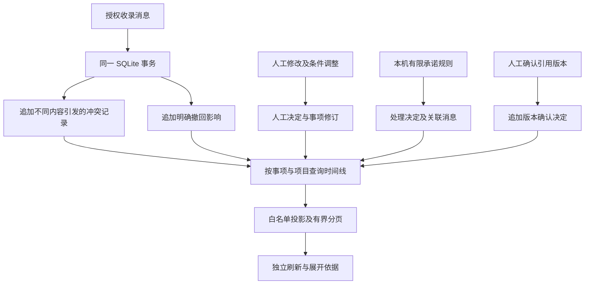
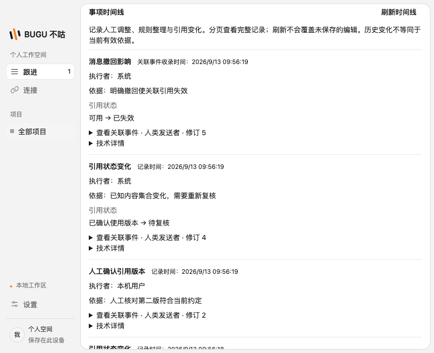

# 事项时间线与引用冲突审计

日期：2026-09-13。需求 U02。基于已实现的人工事项、本机承诺规则、引用版本确认与显式撤回，不包含模型自动决策或自动完成判定。

## 用户体验

事项详情新增独立时间线，分页显示人工字段调整、本机规则整理、引用冲突、人工确认引用版本，以及消息撤回对引用的影响。每项显示可读原因、操作者、记录时间与字段变化；关联事件可展开查看原文摘录、角色、修订、来源和收录时间。长消息仅展示有标记的摘录，避免详情页无界加载。

时间线的刷新和“加载更多”使用独立请求状态，不重新填充事项编辑表单，保留未保存的标题、条件或引用复核草稿。此前最多 100 条的依据区明确标为预览，完整变化从时间线分页查看。

“采集暂停”“授权撤销”“插件卸载”是当前连接状态；“消息撤回”和“引用待复核”是不同事实。来源停用不会删除历史，也不把原文自动认定为撤回。人工证据和规则依据使用同一来源状态解析，按项目范围查询。

## 变更依据

人工变化从已有决定和相邻事项修订读取，不仅展示今天的最终值。规则变化读取处理决定及源事件。明确撤回继续使用已有撤回凭证与影响关系；版本确认沿用已有追加决定。

SQLite v14 新增引用冲突审计：每次不同内容集合使引用需要复核时，在原收录事务内记录触发事件、引用版本、前后状态和内容集合摘要。用户确认后，后续新内容再次使确认失效时会产生新的审计记录。重复页面或相同内容的新修订不重复记冲突。审计写入失败会回滚整页原文与游标，不允许“数据成功但依据遗失”。

历史版本没有逐次保留冲突转换，迁移仅为当前仍待复核的引用生成“迁移时状态快照”，使用实际迁移时间，触发事件留空；不会倒推出原始变化发生时间。撤回影响的时间取关联撤回记录的收录时间并明确标记，不冒充独立的影响写入时间。

## 查询与边界

`workspace.timeline` 是只读白名单 IPC，校验项目、事项、分页参数和返回数据。每页最多 50 项，完整返回体不超过 512 KiB。稳定键和各类记录的首次查询上限组成分页快照，继续加载时不会夹入后来写入但时间更早的记录；刷新开始新的快照。查询在 SQL 中有界枚举，不将全部历史装入渲染进程。跨事项或跨项目使用游标会被拒绝。

返回只包含审核过的字段变化与有界事件摘录，不暴露原始数据库行、完整决定 JSON、凭据或本地路径。坏修订、失效关联及不合法游标返回固定错误。当前来源状态在查询时解析，历史卡片中的过去行为与当前授权状态分开呈现。

导出升级为 v5，包含引用冲突审计与当前来源状态。冲突审计本身不含消息正文；相关触发事件仍遵循项目范围及用户是否导出原文的选择。

本次只追溯现有系统真实记录的变化。旧版本未保存的完整冲突历史无法补造；尚未实现的模型推断、自动条件核验与自动状态变更不会出现在时间线，也不因此视为完成。

## 验证结果

`pnpm check` 通过：1,363 项单元测试、18 组 SQLite 集成、29 项桌面测试通过；2 项原有条件测试跳过。初次全量测试中遗漏的数据库/导出版号与撤销文案断言已更新，重新运行完整检查成功。

专项验证包括 122 条历史的稳定分页、分页期间倒序时间插入不混入旧快照、跨项目与事项游标拒绝、大条件集按响应体积分页、损坏关联/决定拒绝、合法截止时间归一化，以及冲突审计失败时的事务回滚。桌面端通过实际导入、后台候选、两次不同内容编辑、人工引用确认及撤回生成完整时间线；另用 46 条人工变化验证分页、草稿保留和窄窗口真实布局。测试全部使用隔离合成数据。

