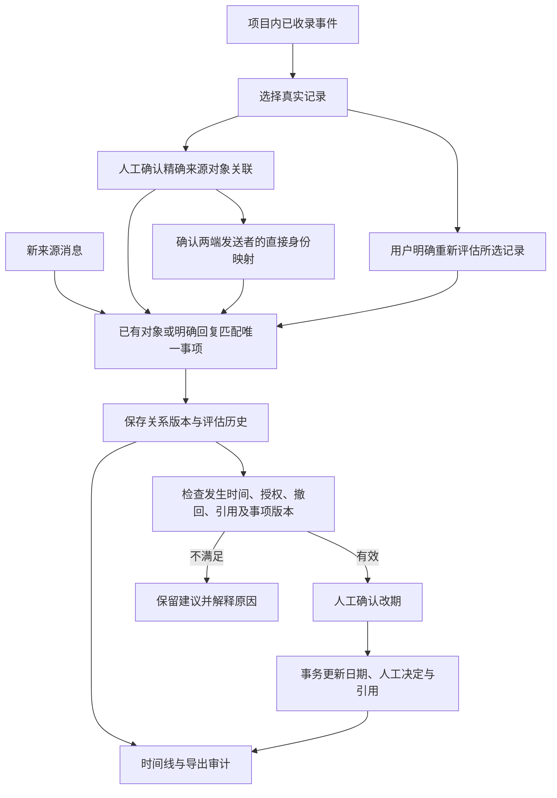
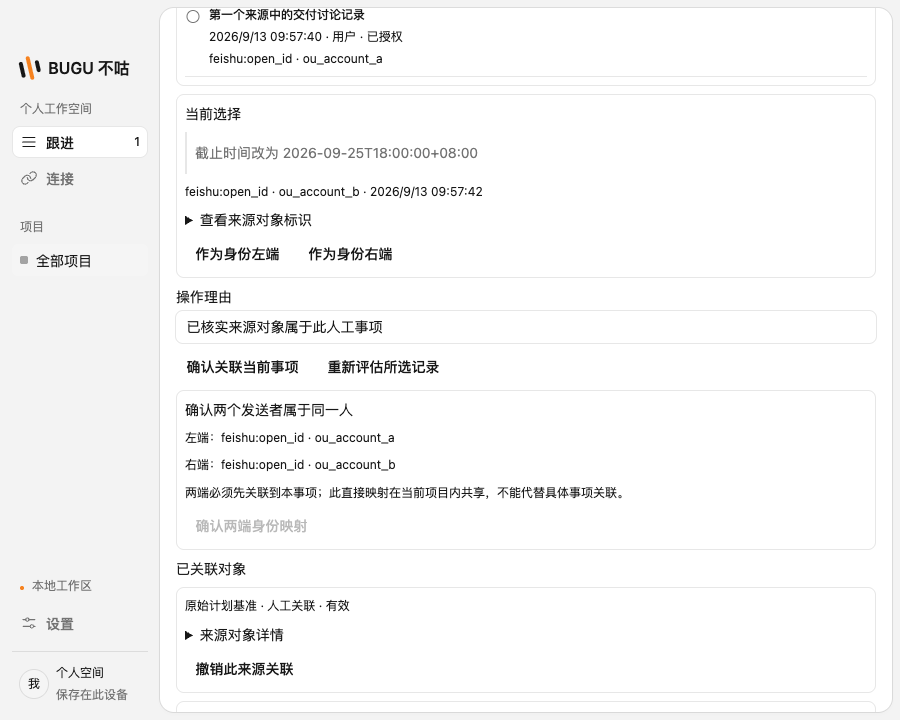

# 人工来源关联与身份映射

本批从最新主分支 `b76bf85` 开发，接通 S07 的生产身份映射与人工事项来源关联。此前 PR95 的 foundation 存储已有身份映射原型，但数据库结构与桌面生产库不同；本批使用生产库显式迁移，复用现有身份键和授权、版本校验规则，没有在应用里另建一份事项库。

## 用户能做什么

1. 在事项详情选择本项目已收录的真实记录，确认这个精确来源对象属于当前事项。界面展示原文摘录、角色、时间和真实发送者标识，不接受手填或模型猜测的身份。
2. 选择已关联记录中的两个发送者，确认他们属于同一人。关系只在当前项目共享，另一事项仍必须单独关联自己的来源对象；同名、同一 ID 出现在另一连接、间接身份链都不能自动合并。
3. 新消息通过明确回复关系进入已绑定事项的改期流程。绑定之前已经处理过的消息，可以由用户选定后重新评估；不会删除旧处理结果或静默扫描全部历史。
4. 撤销来源关联或身份映射。未应用建议需要重新检查关系版本，已人工保存的日期保持不变。重新确认已撤销映射需要版本匹配，并留下完整历史。

首次关联确定事项的原始计划基准。后续添加、撤销来源关联不会悄悄替换这个基准。规则自动创建事项的原有来源关联保留，不能改派给另一事项。

## 生产流程

仍使用上一批的明确绝对日期改期规则。身份映射本身不授予自动修改事项的权限；模型语义处理、相对日期和自动取消不属于本批功能。

## 数据与一致性

- v17 保存精确对象绑定、固定任务基准、项目内直接身份映射和追加审计。关系端点来自已有事件；旧事件缺少作者时保持未知，不能用显示名填补。
- v18 保存改期评估版本、绑定与映射版本证明。人工重新评估会追加历史，旧的评估版本不能用于确认。提交时还要重新检查关系与来源状态。
- 绑定、映射和撤销使用独立版本，不冒充事项标题、状态或支持证据的修改。操作理由、操作者和完整关系快照均保留。
- 时间比较继续使用来源发生时间，来源连接与外部对象组成事件身份。两个来源碰巧采用同样的外部 ID 不会被当成同一事件；接收时间不决定计划先后。
- 后台识别已被人工关联的同一对象时沿用原事项，不重复创建候选。多候选不强制选择。

## 审计和界面

时间线加入来源关联、身份确认与计划评估记录，保留分页快照；旧版五类历史的游标仍可继续读取。导出 v7 增加来源绑定、身份关系、关系操作历史及计划评估证明。项目内复用映射的操作可能发生在另一事项，导出保留与所选事项有关的映射历史及引用，但不导出另一事项本身。

关闭原文选项时，事件正文和改期引用正文不导出；身份标识和关系端点保留，用于解释映射。损坏或越界的证明不能被当作有效审计输出。

独立刷新或确认关联保留未保存的标题、时间和条件草稿。原文、来源标识和映射版本均只作为数据呈现，不执行来源中的指令。

## 边界

每页事件最多 50 条，每个事项累计最多 100 个来源绑定、每个项目累计最多 100 个身份映射，撤销记录也计入上限。超过限制会明确拒绝，不截断后假装完成。未实现自动身份消歧、传递合并、全局账号图谱或任意历史消息回扫。

验证：`pnpm check` 通过，包括类型与包边界检查、1,443 个单元测试（72 个文件）、25 组生产 SQLite 集成检查及独立基础库 42 个场景、31 个桌面测试。原生鼠标穿透和 30 分钟浸泡测试按既有条件跳过，本批未将其计为通过。新增验证覆盖跨来源作者确认、关系撤销与重新评估、历史版本证明、跨事项映射审计、旧游标兼容和真实桌面操作后草稿保留。
