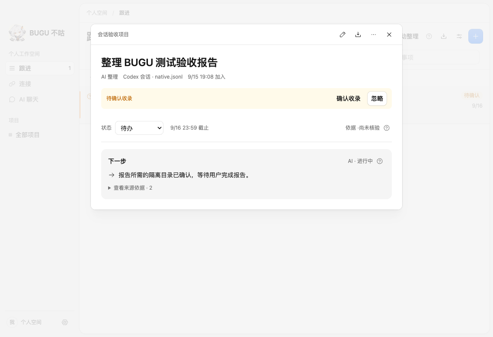
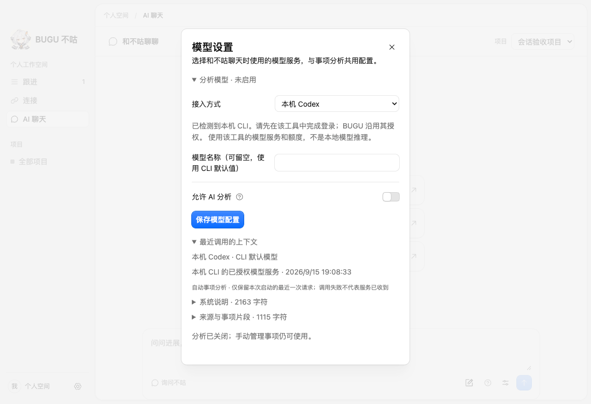
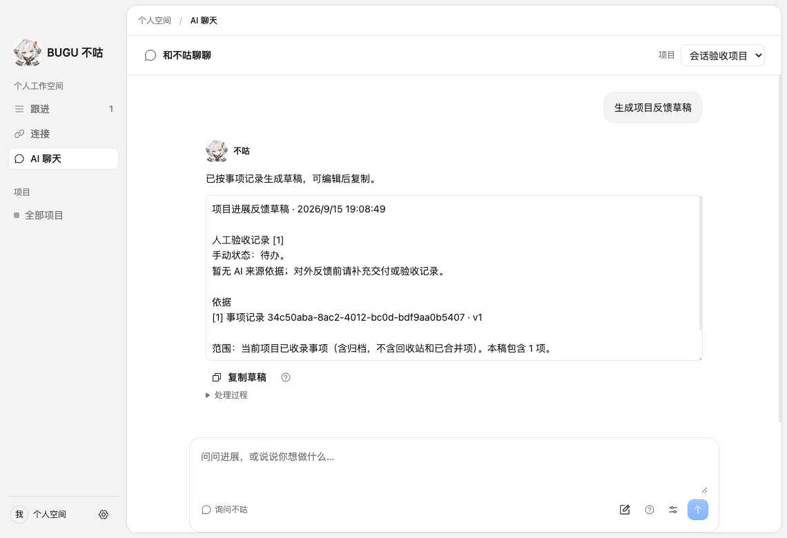

# 十项需求收尾（2026-09-15）

基线：main `52b3bec`；本批分支 `xiangyang/ten-requirements`。选取 D03、D06、L05、A03、T01、Q06、X02、X04、X05、PET14，按需求的实际验收范围交付。

| 需求 | 本批交付 | 验收证据 |
| --- | --- | --- |
| D03 | Codex 来源格式选择、真实客户端 user/assistant/tool/时间样例、版本限制 | 格式说明、capture.json、映射单测 |
| D06 | Codex / Claude 同集实际请求及协议选择，明确 API/CLI 适配边界 | 模型选择报告、原始同集结果 |
| L05 | 真实客户端捕获文件经授权目录进入候选；工具保留但不提取；坏文件隔离 | 定向桌面 E2E、格式与读取单测 |
| A03 | 最近变化类型及原文回放；补齐同句失败与改期的优先级 | 前缀真实模型报告、事项来源详情 |
| T01 | 30 条链、156 个时间前缀；每次只提供当时信息 | time-prefix.ts、可续跑真实模型 runner |
| Q06 | 最近调用内容/服务预览；关闭立即保存，取消活跃请求并阻止新调用 | 关闭竞态单测、模型设置 E2E |
| X02 | 近 24 小时回顾与项目反馈草稿，带版本与原文，可编辑复制 | SQLite 作用域/引用/分页/手动操作测试、聊天 UI E2E |
| X04 | 主窗口恢复、typed bridge、桌宠浮窗响应实测及原生模块决策 | 原生交互测量报告 |
| X05 | 截图 / Browser Use / Computer Use 接入范围及授权评估，回写 PRD | 截图可行性评估、PRD 增补 |
| PET14 | 当前 Hiyori / 30–60 FPS 实际 30 分钟资源采样，恢复与崩溃隔离 | 长测原始数据、短时生命周期测试 |

## 产品范围

草稿以本机已收录事项记录为依据，不额外生成未经引用的内容；当前最多 20 条并明确提示超限，不包含待确认候选、回收站及已合并项。手动状态、AI 下一步建议、来源自述分别标注；复制后由用户自行发送。近 24 小时的变更边界包含生成时刻，避免同毫秒创建/更新的事项漏入日报。

最近调用预览仅在内存保存最近一次请求，最多 65,536 字符且明确标记截断。API 凭据不进入该结构；CLI 沿用其已有服务授权，不称为本地推理。预览列出调用范围，不保证失败请求已经送达服务端。

新 Codex 捕获格式有独立的 v1 封装，不冒充原始 rollout；原生工具消息现在保留用于追溯，但模型上下文继续只收 user / assistant。标准 rollout 的旧消息 ID 保持不变，升级 normalizer 重扫时仍去重。

## 评测口径

时间前缀集为 24 个业务对象的同一 6 阶段模板和 6 条反例链，覆盖六类变化、验收/取消分叉、引用、假设、第三方、建议、否定及旧事实。它用于回放和时间泄漏检查，不代表 30 种独立语言模式，也不能外推真实聊天的 99% 准确率。

首轮 v4：154/156 完全通过；两项在“未验收 + 明确改期”的同句输入中选错最近变化类型。v4.1 明确类型优先级，重新执行完整固定集，原始初测与复测均保留。

v4.1 完整复测 **156/156** 通过。随后真实客户端 UI 出现了独立于固定集的问题：同一报告的环境确认准备步骤被额外收为第二个目标。v4.2 增加同一交付目标的粒度约束后，真实客户端 UI 两次复测通过；同目标跟进、独立双目标、部分范围三个真实模型回归也全部通过（共 4 个目标）。本批没有在 v4.2 上重跑完整 156 项，版本成绩分别记录。

## 验证结果

| 检查 | 结果 | 证据 / 入口 |
| --- | --- | --- |
| 相关单测 | 10 文件、103 项通过 | 会话格式、读取、API、聊天、分析协议、发送预览、时间前缀、真实捕获、分析器、模型进程 |
| SQLite 集成 | 4 组通过 | ten-closeout、model-task-closeout、task-chat、source-import |
| 真实 Codex 来源与 UI | 最新版本通过，含候选、坏文件隔离、上下文预览、关闭后手动新增及草稿 | tests/desktop/ten-closeout.spec.ts |
| 桌宠长测 | 实际 30.2 分钟通过 | [当前 Hiyori 报告](Hiyori新版30分钟实测_2026-09-15.md) |
| 桌宠生命周期 | WebGL 恢复、崩溃隔离、重新打开通过 | tests/desktop/pet-render-lifecycle.spec.ts |
| 交互链测量 | 三段各 30 次采样通过，性能目标尚未达成 | [原生模块评估](原生交互模块评估_2026-09-15.md) |
| 静态与构建 | typecheck、check:boundaries、build、diff --check 通过 | 本地定向检查 |

[评测原始数据目录](../evals/results/ten-closeout-2026-09-15/)保留初测、修复后测量、超时、模型版本、哈希与限定范围。供应商对比见[模型与协议评估](模型选择与输出协议评估_2026-09-15.md)；来源样例见[客户端格式说明](Codex会话格式与真实客户端样例_2026-09-15.md)；截图接入决策见[可行性报告](../research/截图与桌面行为来源可行性评估_2026-09-15.md)。

本批仅运行上述受影响的定向 E2E，不运行全量 E2E，不恢复 CI。未改变原生依赖或打包配置，未重复三平台打包。测试只使用隔离的合成会话和新建客户端会话，不读取个人历史记录；模型调用明确 opt-in，使用本机 CLI 已有服务授权。

## 界面验收







## 定向复跑

使用项目锁定的 pnpm 版本；全局不可用时以 `npx --yes pnpm@10.34.5` 替代。桌面 spec 使用已构建产物，SDK 资产按既有说明准备。

```sh
pnpm typecheck
pnpm check:boundaries
pnpm build
pnpm test:storage ten-closeout-integration model-task-closeout-integration task-chat-integration source-import-integration
BUGU_EVAL_LIVE=1 pnpm test:desktop tests/desktop/ten-closeout.spec.ts
pnpm test:desktop tests/desktop/native-interaction-benchmark.spec.ts
```

时间前缀 runner 编译并运行（输出目录必须是独立的真实路径）：

```sh
node -e "require('esbuild').buildSync({entryPoints:['tests/evals/run-time-prefix.ts'],outfile:'/private/tmp/bugu-prefix.cjs',bundle:true,platform:'node',format:'cjs'})"
BUGU_EVAL_LIVE=1 node /private/tmp/bugu-prefix.cjs /private/tmp/bugu-prefix-results.json
```

复跑使用当时源码协议，不能续写到不同协议的旧报告。Codex 原生捕获可用 `BUGU_EVAL_LIVE=1 node tests/evals/capture-codex.mjs /private/tmp/bugu-new-capture` 生成；脚本只创建新的隔离合成会话，并验证执行的唯一命令为 `pwd`。
