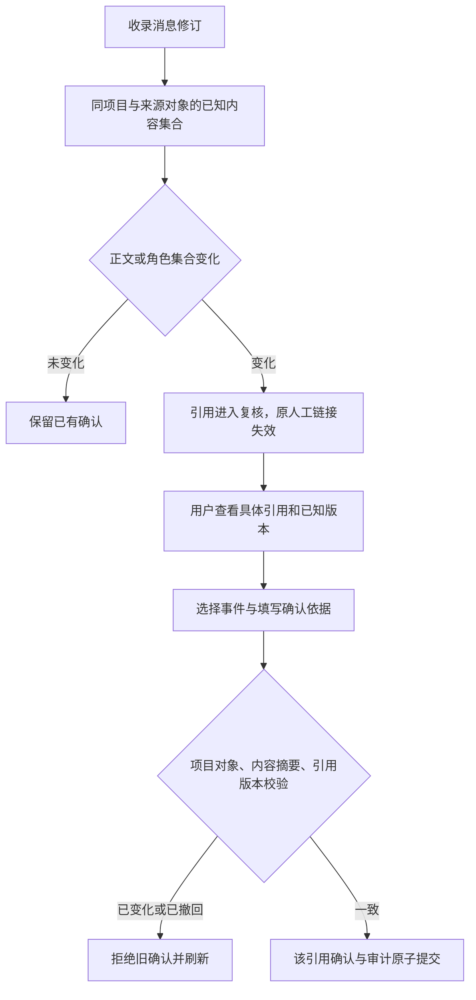
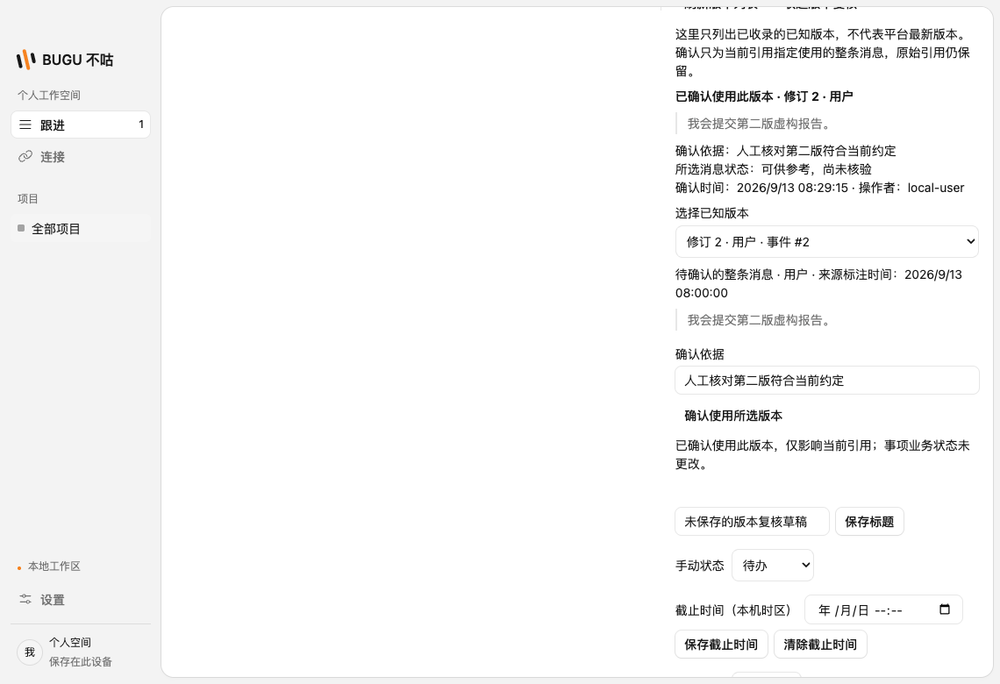
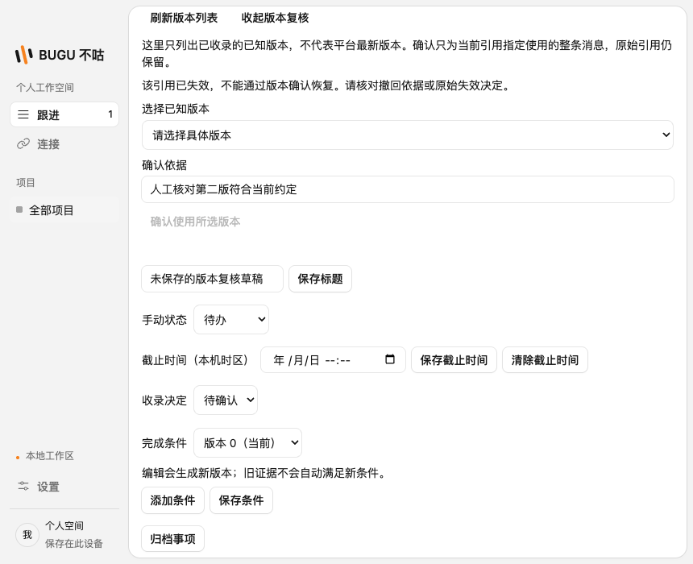
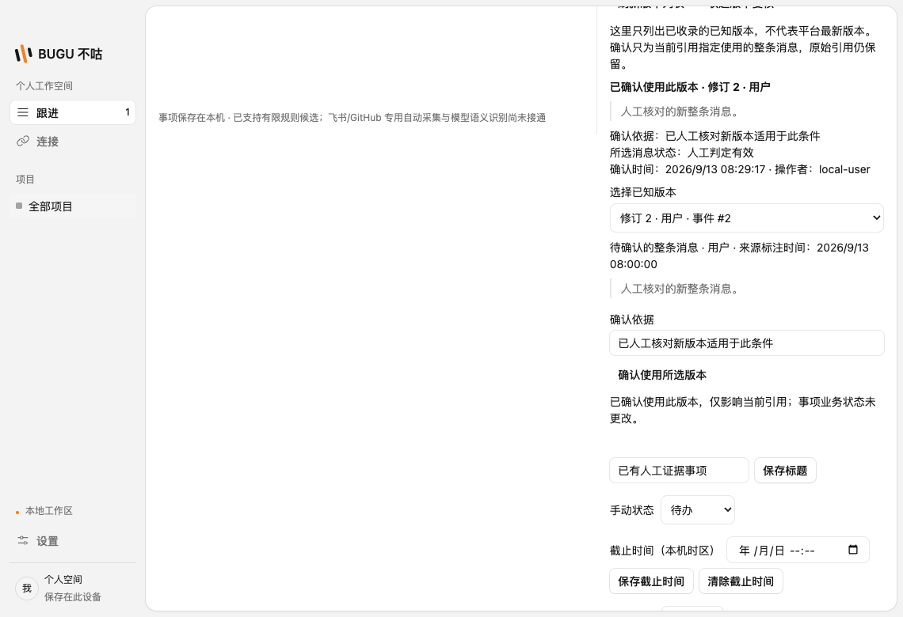

# 引用版本复核与重新确认

本次补齐已收录消息发生编辑后的引用处理。版本标识是不透明字符串，来源时间也未必代表编辑时间，因此不按字符串、到达顺序或消息时间猜平台最新版本。

## 用户行为

当同项目、同连接、同一外部对象出现不同正文或角色的版本时，受影响引用立即进入复核，人工证据链接不再作为有效支持。后台整理暂停也会生效。重复已知版本、相同正文和角色的新修订不会反复撤销已有确认。

详情提供候选引用和已有人工证据链接的独立列表。用户打开具体引用，分页查看已知版本，选择整条消息并填写确认依据。界面说明“已确认使用此版本”，不声称该版本是平台最新版本。

确认只作用于所选引用，不自动恢复其他引用，不自动改变事项标题、完成状态、条件或编辑草稿。原来被人工判无效的证据不能被版本确认恢复；原来为未知的证据仍是未知。显式消息撤回优先，版本确认不能解除撤回。

## 原引用与新选择分开

原始事件、精确引用和人工历史不被改写。选择不同内容后，旧原文片段继续显示失效；新选择以整条消息的人工确认记录展示，不能冒充从新版本重新定位出的精确引用。人工证据原链接也不会被偷偷指向另一条事件。

用户选择与原引用内容、角色相同的已知版本时，可以恢复该原引用的原有效性；原来为未知或人工无效的状态不会被提升。新的不同内容进入系统后，必须重新复核；旧页面提交的确认会被拒绝。

## 事务与数据流

SQLite v11 保存引用复核状态、引用自身版本、已知内容集合摘要及追加的人工确认决定。确认绑定项目、事项、引用类型与 ID、所选事件和预期版本；操作者由本地核心赋值，渲染页面不能指定身份。旧确认不因重试被重复接受。

列表与版本正文分页读取，单页有大小预算；确认结果与原引用分别展示。迁移在同一事务中重新核对旧引用，失败不留下半迁移状态。超过一万种内容版本的旧库也可迁移，不以任意版本数量阈值阻止启动。复核状态缺失、内容摘要矛盾或撤回持久标记与证明不一致时，读取和确认直接报错，不回退为有效。

## 导出

导出 schema v4 保留原事件和旧引用，增加具体引用的当前复核状态、人工确认、所选事件及确认决定。支撑版本冲突的已知事件一并纳入同项目导出范围，受整体条数和字节上限约束。关闭原文时，事件正文、原精确引用以及所选确认消息正文均不输出；用户填写的人工确认理由作为审计内容保留。

## 验收边界

产品可以处理已读取到的编辑或撤回事实，仍无法推断平台不可见的变更。飞书专用授权与持久调度依然未接入。本次不增加人工证据的创建界面；已有人工证据的复核界面通过隔离 SQLite 预置数据，再使用真实桌面界面验证。

本次确认不会自动重评业务完成条件，也没有完整的模型语义计划更新或人物跨来源合并。相关剩余需求继续跟踪。

最终 `pnpm check` 通过：包边界、TypeScript、1,209 个单元测试、构建、14 组 SQLite 集成测试、24 条桌面测试通过，2 条原有专项测试跳过。新增两条桌面流程分别覆盖候选引用和已有人工证据；包括新内容冲突、同内容重放、陈旧确认拒绝、撤回优先、原引用保留和编辑草稿保护。宽、窄窗口截图已检查；复核表单使用局部左对齐样式，输入占满可用宽度。

## 界面记录

