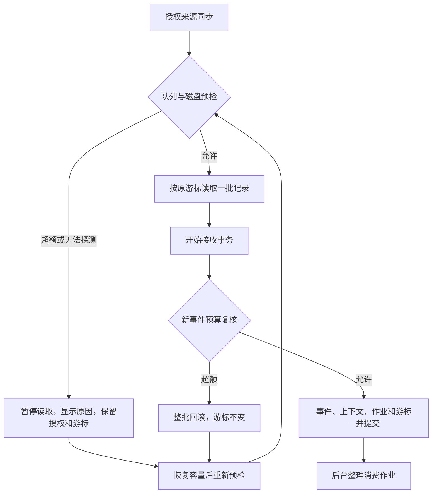
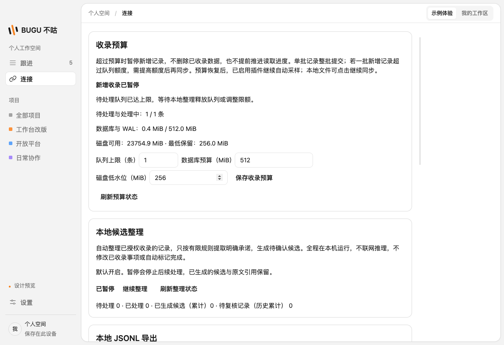
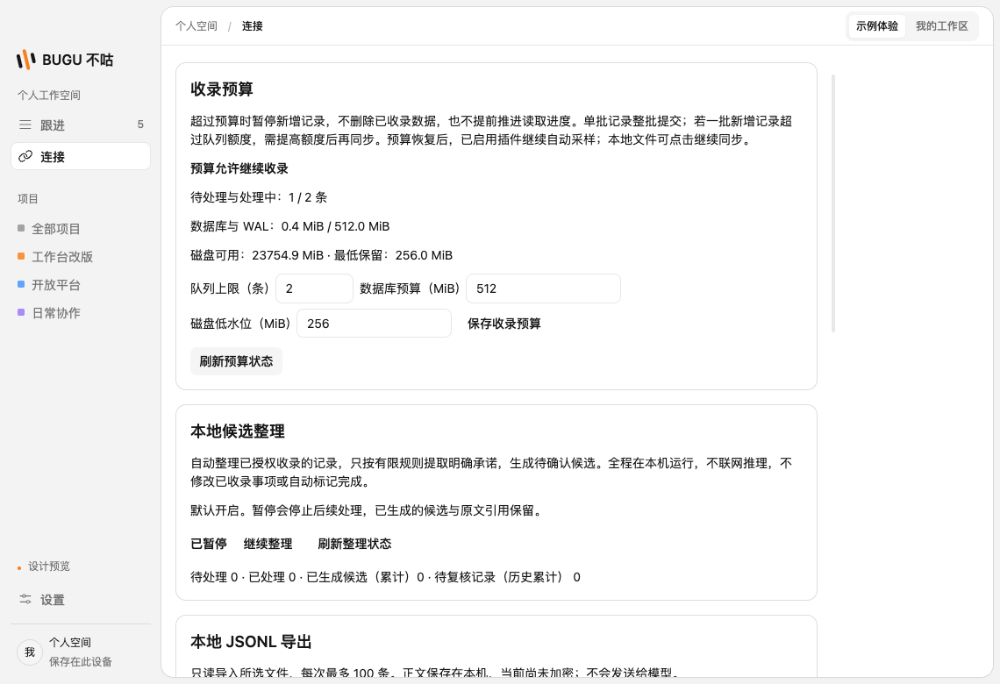

# S08 收录背压与磁盘预算

本次将容量检查接入本地文件与插件的真实采集入口，以及共享事件接收事务。连接页可查看占用、暂停原因和修改预算。SQLite v9 保存预算，重启仍有效。

## 预算口径

| 设置 | 初始值 | 可配置范围 |
| --- | --- | --- |
| 待处理与处理中作业总数 | 10000 条 | 1–100000 条 |
| 数据库与 WAL 总占用 | 512 MiB | 1–8192 MiB |
| 磁盘最低可用空间 | 256 MiB | 1–16384 MiB |

这些是可调整的初始配置，不是设备性能实测上限。磁盘探测使用数据库及 WAL 的真实文件大小、所在文件系统的可用空间；无法读取时关闭新增收录，返回固定错误码，不将本机路径或原始异常暴露给界面。

接收事务还按新事件 UTF-8 编码大小的两倍加 16 KiB 预留预计增长，同批累计，失败和结束时清理预留。这是保守的应用层准入控制，不是操作系统硬配额；SQLite 页分配、索引、检查点及其他进程可能改变实际空间。其他业务写入不受本收录预算限制，避免阻塞处理队列与人工操作。实际写入失败仍由事务回滚，不能确认未持久化的事件。真实 SQLITE_FULL 映射为固定容量错误，不把来源标成授权故障。

## 暂停与恢复

- 来源同步在读取文件前检查，接收每个新事件时在事务内再次检查。插件在读取正文及获取凭据前检查；暂停期间每 60 秒重新检查容量，恢复后按旧游标继续。文件来源由用户再次点击同步。
- 压力不撤销授权，也不写来源故障状态；后台整理可继续处理当前授权来源，释放 pending/running 队列。重复修订在存储接收层不占新事件预算。
- 同一批记录保持原子性。若预算小于一整批新记录数，即使队列为空也会拒收该批，需要提高队列额度；不能先确认其中一部分并跳过剩余记录。
- 队列统计包含已撤权和未绑定事件。这些事件不会被后台自动处理，需恢复相应授权或调整预算。完成作业不意味着数据库文件缩小；数据库超限需调整预算，磁盘低水位需释放空间。
- 配置变化不删除已有记录，降低预算也不修改已经提交的游标。探测失败和压力状态实时计算，不依赖写入一条暂停标记，因此磁盘紧张时仍可显示原因。

## 验证

定向验证已通过：

- 契约及采集入口：非法预算拒绝，插件压力期间不读正文、不取凭据、不写连接错误，冷却后继续旧游标。
- 真实 SQLite：队列 pending/running、整批事件与游标回滚、重复修订、队列消化、批内磁盘预留及回滚清理、预算重启持久化。
- 实际文件探测：隔离数据库与 WAL 大小和 statfs 可用空间一致，缺文件及符号链接拒绝。真实 SQLITE_FULL 通过仅限制临时数据库的 max_page_count 复现，证明未确认事件和游标不变，解除限制后可续传；未填满主机磁盘。
- Electron：暂停整理，预算 1 收第一条、拒第二条；预算 2 继续成功；重启后预算与两条事件/作业持久化，原进度重放不重复。

完整 `pnpm check` 通过：1142 项单测、10 组 SQLite 集成、21 项桌面测试。2 项需要专项运行的原生指针和 30 分钟耐久测试按原配置跳过；本轮未重跑这些与收录预算无关的专项。

