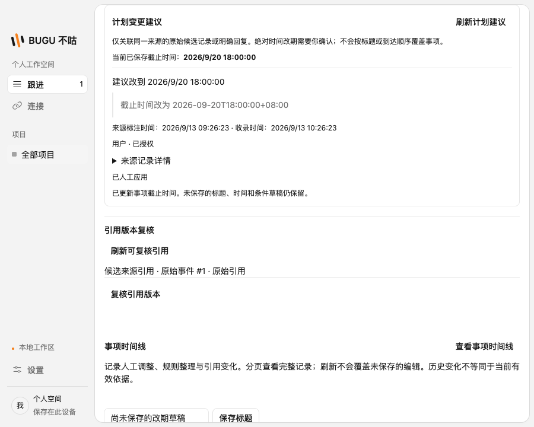

# 明确改期建议与迟到保护

本批从 upstream/main `7a6729f` 开发，推进 S07（身份与时间）、A03（计划变更）和 V05（提交版本与幂等）。本文件描述本批实际范围，完整语义处理和跨源人物映射仍需后续实现。

## 用户流程

飞书中的一条明确承诺被本机规则整理成候选事项后，后续消息可以通过平台提供的直接回复关系关联原事项。只有同一项目、同一连接、唯一已有事项来源对象匹配时才生成改期建议；同名、相似标题和线程根节点都不能建立关联。

首轮规则仅识别单行、明确绝对日期、含时区的格式，例如 `截止时间改为 2026-09-20T10:00:00+08:00`。相对日期、含糊建议、引用、机器人消息及一般语义推断不在此规则内。建议出现后仍需要用户确认，不能直接覆盖事项。原承诺和回复还必须具有相同的明确作者命名空间与 ID；旧记录缺少作者、不同发送者的回复都不能通过本批入口直接应用。

事项详情显示当前截止时间、建议日期、原文和消息发生时间。确认时检查事项版本、条件版本、人工修改版本，以及来源当前授权和撤回状态。确认成功写入既有人工决定和事项修订，时间线可追溯这次截止时间调整；建议本身在独立改期区域查看。

## 身份与升级兼容

SourceEvent v1 增加可选 `metadata`：`author.namespace` / `author.subjectId` 与 `replyToExternalId`。来源连接 ID 与项目范围参与对象关联，显示名不充当身份；缺少标识时保持未知。

飞书映射 `sender.id_type` / `sender.id`，使用 `feishu:<id_type>` 命名空间，仅将 `parent_id` 作为直接回复对象。旧记录没有这些字段时保持原样；带元数据的观察使用稳定的 `:context-v1` 修订标记，超长原修订使用固定哈希表示。元数据内容不会参与修订哈希，同修订下篡改身份或回复对象仍会被拒绝。

数据库 v15 增加可空的原始元数据存储；旧行不补造身份。v16 保存改期建议、任务版本和人工确认记录。规范化 JSON 键顺序不导致伪冲突。

## 时间和并发保护

时间比较使用消息发生时间及显式时区偏移，接收时间只记录采集事实。迟到的旧计划不因晚收到而覆盖已经确认的新计划。不同消息同一时刻但不同计划、无法判断先后的同对象修订均不能直接应用；界面解释原因，由用户核实后另行手动调整。任何已知正文或元数据变体也保守阻断建议，当前引用版本复核不会自动解除这一限制。

提议生成后若用户修改事项，旧提议不能绕过版本检查。重复采集或重复提交不得产生重复的截止时间调整。来源暂停、撤销或原文撤回后，界面仍可解释历史，不能继续采用失效建议。

## 尚未覆盖

- 用户确认跨来源人物映射，以及手动事项的任意原文关联。
- 相对日期解析与命名时区输入；本批使用消息中的显式偏移。
- 模型对六类进展/变更语义的提取、自动条件核验和取消交付。
- 飞书令牌自动刷新、事件订阅及轮询窗口外旧消息变更的完整可见性。

导出升级到 schemaVersion 6，增加改期建议及其基准/消息引用；关闭原文选项时不包含建议引用正文，但仍包含来源对象及明确作者标识，便于核对关系。

以上缺口使 S07、A03、V05 不能仅凭本批有限规则整体标记完成。合入状态以飞书多维表及 PR 为准。

## 验证

基于原始主分支 `7a6729f` 的最终本机 `pnpm check` 通过：1,410 项单测、22 组 SQLite 集成、30 项桌面测试通过，2 项条件跳过。覆盖真实后台消费、飞书 HTTPS 边界模拟、人工确认、草稿保留、身份与修订冲突、迟到、版本竞争、撤权撤回、升级迁移、导出隐私及时间线损坏记录拒绝。

早期全量检查暴露旧迁移夹具、旧版本断言及预加载接口白名单未同步，均已更新后完整重跑。最终检查日志保存于本机 `/tmp/bugu-batch26-final-check-2.log`。

合入前主分支新增 PR95 数据基建，本批已 rebase 至 `78582d7`，保留双方领域导出和两套集成检查，并将新合入测试中的生产数据库版本期望同步为 v16。重验日志为 `/tmp/bugu-batch26-rebased-check.log`；最终提交与 CI 结果见 [PR #100](https://github.com/bread-ovO/Hackathon-WeiYang/pull/100)。
