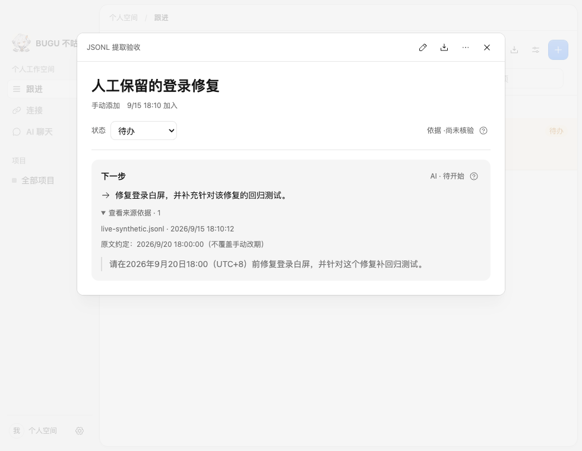
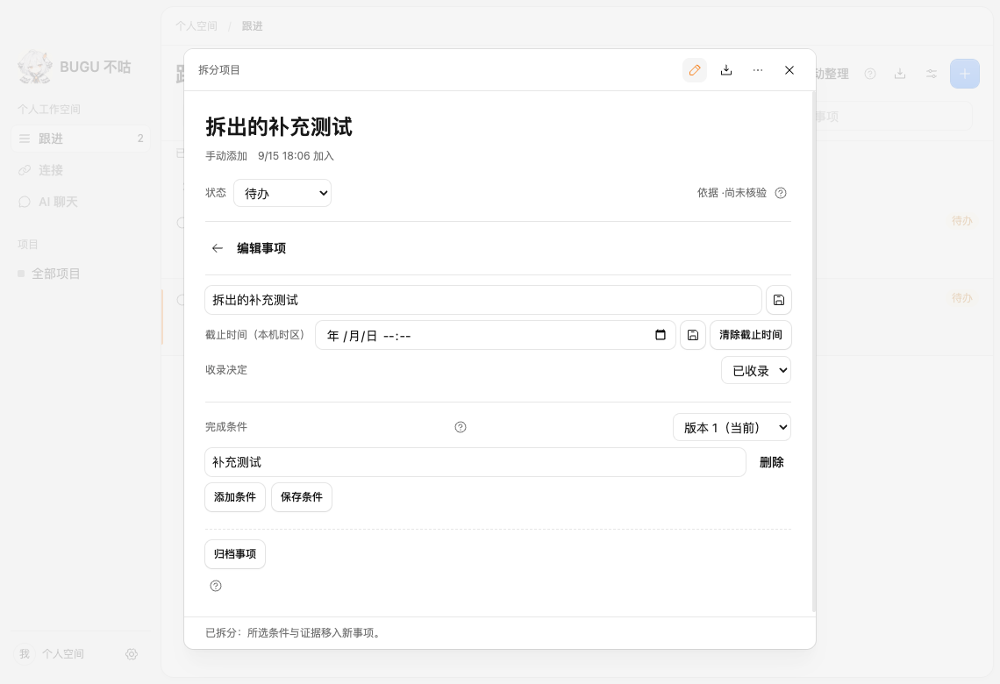

# 未完成需求复核与四项收尾（2026-09-15）

核对基线：`upstream/main b666516`（PR #154 已合入）。本轮工作分支：`xiangyang/backlog-closeout`。

多维表状态统一为 **已完成 / 未完成**。将此前 44 条进行中、14 条待验收、3 条待评审、2 条待开发，共 63 条统一归入未完成，再逐条核对当前代码、既有验收及此次变更。121 条有编号的有效需求原有 58 条已完成；3 条空白/无编号行不计入，未修改其内容。

本轮收尾 A02 / U01 / H03，并确认 H04 的旧备注已过时。这里“已完成”指需求实现及所列定向验收通过，**本轮修复仍需合入 PR 后进入 main**，不表示旧 v0.1.0 安装包已经更新。其余 59 条继续未完成。其余条目的依据是已有实现、既有验收记录与本轮代码差异复核，未重新执行所有外部服务和跨平台测试。

## 本轮修复范围

- **A02**：真实模型返回带原文依据的 `deadline`，上下文携带消息发生时间和显式时区。创建候选时写入日期；含糊约定留空。结构、UTC 日历格式、用户消息、逐字引用在入库前校验。后续日期仅作为建议保留，不覆盖人工改期，不恢复规则建项。
- **U01**：来源过滤纳入模型收录映射，沿合并关系找到保留的任务。旧证据、人工来源绑定、项目/状态/收录/活跃度/归档过滤继续生效。
- **H03**：详情聚合同一来源每个原任务的最新模型建议及引用；支持连续合并。旧分析记录不改写，后续同来源进展携带最终任务 ID，防止重新建项。最多展示最近 32 组，超过上限明确说明；列表只读取一组摘要。打开合并菜单时重新读取目标，避免漏掉刚创建的任务；人工创建的目标仍标为手动来源，合入的模型依据单独展示。
- **H04**：当前主干已有条件/证据事务拆分和双向历史，原表格“无 IPC/UI”备注不再准确。本轮只更新旧 UI 定位和数据库版本断言并复验。

`task-analysis-v3` 保持兼容历史结果，历史结果可无 deadline；新实时请求的严格 Schema 包含 deadline。新增发生时间不改变既有窗口内容指纹，因此不会仅因此次升级重放历史窗口，也不强制补算旧任务日期。新字段的日期语义由真实模型判断，引用校验只能确认出处，不能证明模型永远理解正确。

## 验证

- 53 项相关单测通过：分析契约、提取/复核、自动整理、宿主 Schema 与 API 传输。
- 6 个存储集成入口通过：新模型截止/来源/连续合并/后续身份/重启、既有分析、纯模型提取、拆分、五项需求及任务模型。
- 日期专项：真实 Codex CLI 默认模型，10 个合成会话、20 次模型调用，10/10 通过。覆盖相对日期、绝对日期、仅日期、星期、含糊时刻、标题日期、助手提议、缺失发生时间与示例排除；[原始结果](../evals/results/backlog-closeout-2026-09-15/deadline-live.json)。这是定向回归，不能推导为真实用户数据稳定 99%，也没有重跑前一版 100 例质量集。
- 2 个定向 Electron E2E 通过：真实模型从 JSONL 自动生成带截止候选→保留人工目标合并→引用可见→来源筛选→重载保留；事项 UI 拆分及两侧条件归属。宽/窄截图人工检查无横向溢出。期间旧测试定位/文案断言更新，发现并修复隐藏合并面板不刷新目标列表的问题；最终结果通过。
- typecheck、build、check:boundaries、git diff --check 通过。没有数据库版本或依赖变更；未运行全量 E2E，未恢复 CI。
- 代码自查覆盖跨项目限制、严格引用与日期结构、人工日期/状态优先、连续合并、幂等/重启与列表读取上限；尚未声称跨平台实机或其他模型服务联调完成。




日期专项可复现命令（只构造合成消息，复用已授权 CLI 调用）：

```sh
node -e 'require("esbuild").buildSync({entryPoints:["tests/evals/run-deadlines.ts"],outfile:"apps/desktop/out/deadline-eval.cjs",bundle:true,platform:"node",format:"cjs",tsconfig:"tsconfig.json"})'
BUGU_EVAL_LIVE=1 node apps/desktop/out/deadline-eval.cjs /tmp/bugu-deadline-eval.json
```

## 63 条复核明细

下表记录本轮状态及具体缺口。链接指向当前仓库相应实现、测试或既有验收记录；跨源语义汇总、真实客户端/租户联调、签名许可等没有因界面存在或安装包构建成功而标完成。

| 编号 | 需求 | 状态 | 本轮结论 | 代码或既有证据 |
| --- | --- | --- | --- | --- |
| D02 | 验证飞书身份与权限 | 未完成 | 仍缺真实飞书租户的身份、scope、历史与撤回可见性矩阵。文档权限验证不能替代会话读取验证。 | [D02_飞书身份权限验证_2026-09-13.md](../../docs/engineering/D02_飞书身份权限验证_2026-09-13.md) |
| D03 | 选择本地 AI 会话来源 | 未完成 | 已支持三种会话格式；仍缺目标客户端版本的三角色原生样例及限制记录。合成格式样本不算真实客户端版本验收。 | [session-mappers.ts](../../packages/plugin-host/src/session-mappers.ts) |
| D05 | 确定推理及数据保留策略 | 未完成 | API/CLI 调用授权与来源授权已分开；保留周期、费用上限及未决项负责人尚未闭环。 | [真实模型任务提取与分段复核_2026-09-15.md](../../docs/engineering/真实模型任务提取与分段复核_2026-09-15.md) |
| D06 | 选择模型与输出协议 | 未完成 | 严格输出协议及 Codex 固定集质量报告已有；其他提供方的同集质量、成本、延迟对比未完成。 | [真实模型提取修复评测_2026-09-15.md](../../docs/evals/真实模型提取修复评测_2026-09-15.md) |
| L03 | 文件增量和轮转恢复 | 未完成 | 追加、半行续读、重扫已有测试；仍缺轮转前未读完整行从旧文件补采的保证。 | [jsonl-extraction.spec.ts](../../tests/desktop/jsonl-extraction.spec.ts) |
| G03 | 测试与部署证据区分 | 未完成 | 当前 GitHub 采集覆盖 PR/Issue/评论；测试运行与部署记录的生产采集和证据分类未接通。 | [github.ts](../../packages/connectors/src/github.ts) |
| A02 | 截止时间解析 | 已完成 | 本轮补齐真实模型 deadline 字段、原消息时间/时区及逐字依据；新候选写入日期，含糊日期留空。后续改期仅保留建议，不覆盖人工日期；历史已处理窗口不强制回放。 | [model-task-closeout-integration.ts](../../tests/model-task-closeout-integration.ts) |
| A03 | 进展和变更提取 | 未完成 | 阶段建议及同来源延续已有；通用失败/改期/补充等六类完整时间链回放、跨来源变更未全验收。 | [真实模型任务提取与分段复核_2026-09-15.md](../../docs/engineering/真实模型任务提取与分段复核_2026-09-15.md) |
| A04 | 跨源候选关联 | 未完成 | 明确 PR/Issue 对象的同项目关联已有；当前模型新建任务尚无通用跨会话语义召回/归并。 | [真实模型任务提取与分段复核_2026-09-15.md](../../docs/engineering/真实模型任务提取与分段复核_2026-09-15.md) |
| A05 | 不确定关联处理 | 未完成 | 明确对象的多候选人工确认/排除与映射复用已有；通用多来源模型关联仍依赖 AG05，不整体结项。 | [真实模型任务提取与分段复核_2026-09-15.md](../../docs/engineering/真实模型任务提取与分段复核_2026-09-15.md) |
| A07 | 模型失败与取消 | 未完成 | 超时、取消、迟到拒绝已有；持久化重试上限、费用预算和运行级恢复仍缺。 | [真实模型任务提取与分段复核_2026-09-15.md](../../docs/engineering/真实模型任务提取与分段复核_2026-09-15.md) |
| V02 | 证据关系核验 | 未完成 | PR 提交与同链接反馈分别核验已有；任意完成条件的通用语义核验仍未接通。 | [BUGU_PR交付闭环_D04.md](../../docs/product/BUGU_PR交付闭环_D04.md) |
| V03 | 业务状态转换 | 未完成 | 人工业务状态、归档、收录已分开；通用证据驱动状态转换未完成，模型阶段不自动修改业务完成。 | [真实模型任务提取与分段复核_2026-09-15.md](../../docs/engineering/真实模型任务提取与分段复核_2026-09-15.md) |
| V04 | 低风险自动完成策略 | 未完成 | 低风险辅助判断存在，缺可关闭的完整自动完成策略、充分条件及冲突/人工阻止联动。 | [index.ts](../../packages/domain/src/index.ts) |
| V06 | 撤回证据后的重评估 | 未完成 | 撤回引用失效与人工完成保留已有；自动完成结果的重评估和更正尚未闭环。 | [retractions.ts](../../packages/storage/src/retractions.ts) |
| H03 | 事项合并 | 已完成 | 本轮补齐合并目标的模型来源聚合、原引用保留、来源过滤及后续进展转向最终目标；旧 ID、条件去重、证据迁移与审计原有能力复验。 | [model-task-closeout-integration.ts](../../tests/model-task-closeout-integration.ts) |
| H04 | 事项拆分 | 已完成 | 旧备注已过时：主干已有拆分 IPC/UI、条件与证据事务迁移、双向历史。更新旧版验收脚本后定向复验，不另造重复实现。 | [task-structure-integration.ts](../../tests/task-structure-integration.ts) |
| H05 | 撤销自动和人工操作 | 未完成 | 部分来源关系可撤销；通用操作的按范围撤销、保留后来无关编辑及冲突说明仍缺。 | [task-model.ts](../../packages/storage/src/task-model.ts) |
| U01 | 事项列表和筛选 | 已完成 | 本轮补齐模型候选及合并任务按原来源筛选；保留项目、业务状态、收录、活跃度和归档过滤，真实空态不塞示例数据；模型后续进展计入活跃度，业务状态仍由人工决定。 | [model-task-closeout-integration.ts](../../tests/model-task-closeout-integration.ts) |
| U04 | 有引用的事项问答 | 未完成 | 聊天能查任务，但任意回答逐引用有效性校验和覆盖不足说明仍未形成完整闭环。 | [Agent编排与任务聊天_2026-09-14.md](../../docs/engineering/Agent编排与任务聊天_2026-09-14.md) |
| N01 | 提醒触发与静默默认 | 未完成 | 桌宠话语与通知辅助函数存在；事项期限/阻塞/决策的生产通知触发与理由链未接通。 | [index.ts](../../packages/domain/src/index.ts) |
| N02 | 冷却和稍后提醒 | 未完成 | 桌宠免打扰不是事项通知冷却；事项提醒的稍后提醒、关闭及重复证据去重仍缺。 | [index.ts](../../packages/domain/src/index.ts) |
| N03 | 通知 outbox 恢复 | 未完成 | 已有事务 outbox 表，缺生产投递消费者、崩溃恢复投递和 OS 重复窗口说明。 | [task-model.ts](../../packages/storage/src/task-model.ts) |
| P06 | 第三方真实适配验收 | 未完成 | 插件运行时存在；缺独立第三方开发者接入差异来源的耗时、修订/恢复/拒绝记录。 | [third-party-adapter-acceptance.json](../../docs/evals/third-party-adapter-acceptance.json) |
| Q02 | 加密存储探针 | 未完成 | safeStorage 保护凭据，生产业务库仍为普通 SQLite；加密库及安装包恢复探针未完成。 | [index.ts](../../packages/storage/src/index.ts) |
| Q05 | 删除与派生清理 | 未完成 | 生产库删除接口、派生缓存、后台作业、WAL/备份清理范围与入口未闭环。 | [真实模型任务提取与分段复核_2026-09-15.md](../../docs/engineering/真实模型任务提取与分段复核_2026-09-15.md) |
| Q06 | 云推理范围和关闭 | 未完成 | 可关闭模型且保留手工操作；完整逐次发送片段展示仍缺，不以提供方名称代替范围预览。 | [真实模型任务提取与分段复核_2026-09-15.md](../../docs/engineering/真实模型任务提取与分段复核_2026-09-15.md) |
| T01 | 建立时间前缀评测集 | 未完成 | 固定 100 个合成会话已有，缺约 30 条完整事件链逐时间前缀独立评分。 | [真实模型提取修复评测_2026-09-15.md](../../docs/evals/真实模型提取修复评测_2026-09-15.md) |
| T02 | 简单基线与质量报告 | 未完成 | 已有固定集误收/漏项/重复报告；跨来源误关联、错误自动完成与真实覆盖率尚未评测。 | [真实模型提取修复评测_2026-09-15.md](../../docs/evals/真实模型提取修复评测_2026-09-15.md) |
| T03 | 关键故障集成验证 | 未完成 | 相关单元/存储/桌面故障测试已有；跨来源并发及完整自动完成故障矩阵未闭环。 | [真实模型提取修复评测_2026-09-15.md](../../docs/evals/真实模型提取修复评测_2026-09-15.md) |
| T04 | 资源成本和可观测性 | 未完成 | 调用耗时和桌宠短时 CPU/FPS 已有；主链路空闲/增量/回补的 CPU、内存、磁盘、费用基线仍缺。 | [真实模型提取修复评测_2026-09-15.md](../../docs/evals/真实模型提取修复评测_2026-09-15.md) |
| T05 | 冻结扩大试用门槛 | 未完成 | 固定合成集通过用户要求的 99% 门槛；真实独立集与试用资源/费用/覆盖门槛尚未冻结。 | [真实模型提取修复评测_2026-09-15.md](../../docs/evals/真实模型提取修复评测_2026-09-15.md) |
| T06 | 签名分发与迁移备份 | 未完成 | v0.1.0 三平台 CD 发布已有；签名、公证与生产迁移失败恢复入口未完成。 | [版本发布.md](../../docs/engineering/版本发布.md) |
| T07 | 回滚与策略止损 | 未完成 | 可停模型/后台，人工任务保留；策略/插件/应用整体回退与自动完成止损演练未闭环。 | [真实模型任务提取与分段复核_2026-09-15.md](../../docs/engineering/真实模型任务提取与分段复核_2026-09-15.md) |
| T08 | 真实使用净收益验证 | 未完成 | 缺真实用户维护时间、纠错/无效提醒成本与原工作方式对照，不能用任务数量证明收益。 | [real-usage-feedback.json](../../docs/evals/real-usage-feedback.json) |
| X01 | 外部 Agent 上下文查询 | 未完成 | 暂无对外 Agent 的授权上下文查询服务、范围限制与调用审计。 | [records.json](../../docs/planning/records.json) |
| X02 | 日报与反馈草稿 | 未完成 | 暂无有依据的日报/反馈草稿产品入口；任务导出不等于草稿。 | [workspace.ts](../../apps/desktop/src/core/workspace.ts) |
| X03 | 评估向量检索收益 | 未完成 | 只有 FTS 基线，缺向量检索同集收益、资源与索引恢复成本比较。 | [records.json](../../docs/planning/records.json) |
| X04 | 评估原生交互模块 | 未完成 | 现有原生选型 JSON 仅候选/标准，缺快捷入口及浮窗响应瓶颈对照；使用 Swift 本身不算评估完成。 | [native-interaction-evaluation.json](../../docs/evals/native-interaction-evaluation.json) |
| PET14 | 性能与故障恢复 | 未完成 | 新版 Hiyori 短时帧率和恢复已有；缺当前默认模型/性能档的 30 分钟资源稳定性报告。旧 Haru 报告不能替代。 | [桌宠省电档与异步回读_2026-09-15.md](../../docs/engineering/桌宠省电档与异步回读_2026-09-15.md) |
| PET15 | 模型与 SDK 发布许可检查 | 未完成 | 模型/SDK 哈希与许可文件已随包；BUGU 发布类别及适用协议、默认角色权利确认仍未闭环。 | [Live2D许可与发布边界_2026-09-13.md](../../docs/engineering/Live2D许可与发布边界_2026-09-13.md) |
| PET16 | 桌宠集成验收与演示 | 未完成 | 坏模型、路径与渲染恢复测试已有；真实睡眠、多屏插拔及 Windows 独立设备矩阵仍缺。 | [桌宠省电档与异步回读_2026-09-15.md](../../docs/engineering/桌宠省电档与异步回读_2026-09-15.md) |
| L04 | Claude Code 会话接入 | 未完成 | 授权目录、格式映射和真实模型处理合成样例已验收；真实 Claude 客户端版本产物兼容验收仍缺。 | [jsonl-extraction.spec.ts](../../tests/desktop/jsonl-extraction.spec.ts) |
| L05 | Codex 会话接入 | 未完成 | 授权目录、格式映射和真实模型处理合成样例已验收；真实 Codex 客户端版本产物兼容验收仍缺。 | [jsonl-extraction.spec.ts](../../tests/desktop/jsonl-extraction.spec.ts) |
| L06 | Kimi 会话接入 | 未完成 | 授权目录、格式映射和真实模型处理合成样例已验收；真实 Kimi 客户端版本产物兼容验收仍缺。 | [jsonl-extraction.spec.ts](../../tests/desktop/jsonl-extraction.spec.ts) |
| G05 | GitHub 全账户内容监听 | 未完成 | 账户仓库发现、分页/限流恢复已实现；真实私库权限组合仍缺验收，周期快照也不能追回已删除评论。 | [github-runtime.ts](../../apps/desktop/src/main/github-runtime.ts) |
| P07 | 插件开发文档与公开 Schema | 未完成 | 指南/Schema 已更新为真实模型链路；缺未参与核心开发者按文档接入差异来源的独立验收。 | [README.md](../../docs/plugins/README.md) |
| X05 | 截图与桌面行为来源可行性评估 | 未完成 | 竞品调研已有，截图/桌面行为来源的接入决定、范围、授权及 PRD 回写尚未完成。 | [多信源AI事项助手_PRD_v0.3.md](../../docs/product/多信源AI事项助手_PRD_v0.3.md) |
| MOD01 | Responses API 事项分析 | 未完成 | Responses 适配和隔离 HTTP 测试存在；仍缺真实 API Key 服务联调，不把 CLI 成绩算作 API 验收。 | [真实模型提取修复评测_2026-09-15.md](../../docs/evals/真实模型提取修复评测_2026-09-15.md) |
| MOD02 | Chat Completions API 事项分析 | 未完成 | Chat Completions 适配和隔离 HTTP 测试存在；仍缺真实兼容服务联调。 | [真实模型提取修复评测_2026-09-15.md](../../docs/evals/真实模型提取修复评测_2026-09-15.md) |
| MOD04 | 复用本机 Claude Code 登录分析 | 未完成 | Claude CLI 适配存在，上次真实调用超时；本轮没有复验该提供方，保持未完成。 | [真实模型提取修复评测_2026-09-15.md](../../docs/evals/真实模型提取修复评测_2026-09-15.md) |
| MOD05 | 复用本机 Kimi 登录分析 | 未完成 | Kimi 推理 CLI 未实现、未完成目标版本验证；历史会话导入不等于推理调用。 | [真实模型任务提取与分段复核_2026-09-15.md](../../docs/engineering/真实模型任务提取与分段复核_2026-09-15.md) |
| MOD07 | 在线模型验收与质量基准 | 未完成 | Codex 固定集及本轮日期专项真实调用报告已有；其他提供方同集质量/耗时/错误/费用对比仍缺。 | [真实模型提取修复评测_2026-09-15.md](../../docs/evals/真实模型提取修复评测_2026-09-15.md) |
| AG01 | Agent 职责与编排协议 | 未完成 | 提取→复核及聊天工具循环已实现；完整跨来源 Agent 职责、DAG 状态机与失败协议未全落地。 | [真实模型任务提取与分段复核_2026-09-15.md](../../docs/engineering/真实模型任务提取与分段复核_2026-09-15.md) |
| AG02 | 项目上下文与多源证据装配 | 未完成 | 单来源分段及任务记忆已有；本轮补合并目标身份，仍无多来源联合证据装配。 | [真实模型任务提取与分段复核_2026-09-15.md](../../docs/engineering/真实模型任务提取与分段复核_2026-09-15.md) |
| AG03 | 事件触发与增量分析调度 | 未完成 | 自动扫描、已完成片段游标持久化已有；运行级持久模型作业、去抖/背压和崩溃续跑仍缺。 | [真实模型任务提取与分段复核_2026-09-15.md](../../docs/engineering/真实模型任务提取与分段复核_2026-09-15.md) |
| AG04 | 任务分派与依赖执行 | 未完成 | 聊天最多 4 步，提取/复核顺序执行；无完整 DAG 依赖、受限多分支并发及独立失败汇总。 | [真实模型任务提取与分段复核_2026-09-15.md](../../docs/engineering/真实模型任务提取与分段复核_2026-09-15.md) |
| AG05 | 分析结果汇总与冲突处理 | 未完成 | 同来源复核/延续和人工合并已有；不同来源自动关联建议及否定/冲突联合判断仍缺。 | [真实模型任务提取与分段复核_2026-09-15.md](../../docs/engineering/真实模型任务提取与分段复核_2026-09-15.md) |
| AG06 | 编排取消、重试与恢复 | 未完成 | 调用取消与退避已有；持久重试计数、鉴权/限流/格式失败分类恢复及 DAG 续跑仍缺。 | [真实模型任务提取与分段复核_2026-09-15.md](../../docs/engineering/真实模型任务提取与分段复核_2026-09-15.md) |
| AG07 | 编排建议复核与原子提交 | 未完成 | 聊天写操作预览、版本检查和原子事务已有；跨来源多 Agent 汇总与多实体一致提交未完成。 | [真实模型任务提取与分段复核_2026-09-15.md](../../docs/engineering/真实模型任务提取与分段复核_2026-09-15.md) |
| AG08 | 编排运行轨迹与诊断界面 | 未完成 | 聊天过程及后台轻量状态可见；按步骤耗时、重试次数、故障定位与单步重试入口仍缺。 | [真实模型任务提取与分段复核_2026-09-15.md](../../docs/engineering/真实模型任务提取与分段复核_2026-09-15.md) |
| AG09 | 编排回放与故障验收 | 未完成 | 真实模型与模拟故障报告分开保存；多源并发、完整 DAG 崩溃恢复验收矩阵仍缺。 | [真实模型提取修复评测_2026-09-15.md](../../docs/evals/真实模型提取修复评测_2026-09-15.md) |
| CHAT3 | 飞书会话的模型任务提取 | 未完成 | 飞书同步内容可送模型，授权/版本检查已有；仍缺真实租户会话到候选的全链路联调。 | [真实模型任务提取与分段复核_2026-09-15.md](../../docs/engineering/真实模型任务提取与分段复核_2026-09-15.md) |
