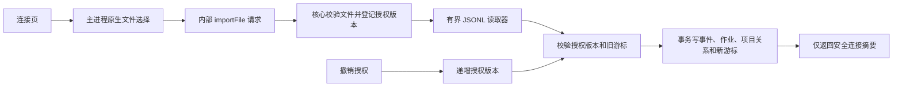

# 本地 JSONL 导入交付

连接页选择已有项目，通过系统文件选择器授权单个 JSONL 文件。可手动同步、查看事件数和最近成功时间、撤销授权。连接配置属于本机真实数据，独立于示例事项；SQLite 当前明文存储，不向模型发送内容。



## 文件约定

每行一个 UTF-8 JSON 对象，以换行结束。例如：

```json
{"id":"example-1","revision":"1","created_at":"2026-09-13T00:00:00Z","role":"user","content":"明天确认设计稿"}
```

角色保留 user / assistant / tool / system。来源 ID 由宿主注入，不接受文件覆盖。原始事件 ID 和修订用于去重；同一修订改变内容会报冲突。未换行末行留待下次同步，完整非法行拒绝当前批次，游标不提前推进。

单文件最多 16 MiB，单行 128 KiB，每批最多 100 条和 4 MiB 文本字符。文件大于一批时继续点击同步。游标绑定文件身份、映射、已读前缀和所选路径；追加续读，轮转或截断重扫并由数据库去重。路径检查拒绝符号链接及文件身份变化；这不是对同用户恶意进程的完整文件系统沙箱。

## 授权和数据一致性

公开 IPC 只接收项目 ID 或来源 ID，不接收路径、游标、授权版本；内部 importFile 不向 renderer 开放。摘要不暴露绝对路径。撤权使在途批次的授权版本失效，不能提交事件或覆盖连接状态；已有事件保留。重新授权沿用同一来源，重复同步不重复入队。

事件、作业、项目映射、游标和成功时间一起提交；任一步失败回滚。按来源限制同时同步，提交校验旧游标，避免并发覆盖。错误展示固定诊断码，不泄露文件内容。

## 验证与剩余范围

`pnpm check` 通过：286 项单元测试、5 组 SQLite 集成、4 项真实 Electron 桌面测试。覆盖半行续读、重复导入、取消选择、撤权、重新授权、符号链接拒绝、授权竞态、游标冲突、事务回滚及 v4 迁移。测试使用虚构文件和隔离用户目录。

目前只支持通用 JSONL 导出文件；没有目录监听、Codex 等原生会话格式、HTTP 执行器或模型消费器。导入不会自动生成事项。Q03 的后续队列执行阶段授权检查仍待实现，不能把本次读取批次保护等同于完整流水线验收。
