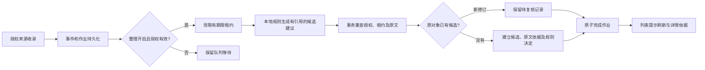

# BUGU 本地候选整理闭环

本批接通实际后台事项处理路径。用户授权收录的事件会在本机按 explicit-commitment-v1 规则整理为待确认候选，默认开启，可在连接页暂停或继续；没有云推理调用，没有自动完成或自动修改已收录事项。

## 从收录到候选

核心每批最多处理 4 个作业，然后让出事件循环；闲置时每秒检查，异常有上限退避。读取范围由授权绑定项目和 event_projects 联合限定，事件正文不能选择项目、任务 ID 或提交操作。暂停同时阻止领取与提交，并在重启后保留。

## 规则范围与可解释性

仅提取 user 角色中以“我会提交…”“我来修复…”或“I will submit…”等明确句式表达的有限动作。assistant、tool、system 不转为用户承诺；问句、条件、假设、引用、否定和已完成描述不直接建项。代码块跳过，每条候选保留原始 UTF-16 片段位置。截止时间留空，不靠关键词猜日期；改期、取消或超量输入进入待复核。

这是一项可直接运行的本地候选能力，不是完整自然语言理解。省略主语、嵌入时间、隐含承诺等会漏召回。候选需要用户确认，不能把有限规则的回归结果当作 A01/A03 全场景准确率评测。

## 事务与恢复

SQLite v8 保存处理结果、来源对象到候选的关系、引用和独立的 rule 决定。自动候选不会伪造 manual actor，初始人工版本为 0。每个事件修订只提交一次处理结果，候选、检索索引、原文依据、初始历史与作业完成一起提交或一起回滚。

提交前重新从数据库生成规则结果，拒绝外部改写标题、引用、项目或修订。对已有来源对象的新修订，只记录待复核并保留原事项；不按接收顺序、序号或相似标题覆盖用户修改。不同项目不因同名合并。

租约令牌始终递增。暂停或撤权释放领取时增加独立的重试抵扣，不减小令牌，防止旧执行者在令牌复用后提交。真正的执行失败最多尝试 3 次，失败仍保留原事件与诊断。

## 界面与导出

连接页显示队列数量、处理状态和暂停开关；真实列表发现新的处理结果后提示刷新，不覆盖用户正在编辑的表单。详情用纯文本展示原引用、规则来源、来源状态及新修订的待复核摘录；摘录不作为完成证据。规则版本保留在数据和导出中。没有关联事项的待复核记录暂只有历史累计计数，需对照来源人工处理；尚未提供统一复核收件箱。

导出格式升级为 v2，保留原有字段，新增规则决定与候选依据。所有关联事件仍按项目和选中事项范围导出；关闭原文导出时，引用正文与摘录不进入结果，保留定位和规则元数据。

## 验证

`pnpm check` 全部通过：1113 项单测、9 组真实 SQLite 集成、20 项桌面测试。2 项默认跳过为原生鼠标设备测试和已在 PR #88 单独完成的 30 分钟桌宠长测。

新增验收覆盖：同一事件重复十次只一次事项创建、重启去重、修订待复核、人工字段保持、跨项目拒绝、撤权/停用/卸载、租约过期与暂停令牌不复用、失败回滚、坏旧记录诊断、105 次修订仍可看到初始引用和最新内容，以及导出关闭原文后的隐私与完整性。

真实界面记录：[暂停与队列](images/processing-paused_2026-09-13.png)、[候选原文](images/processing-citation_2026-09-13.png)、[新修订待复核](images/processing-revision-review_2026-09-13.png)。全部使用隔离目录与虚构数据。

模型供应商、语义计划更新、跨来源人物映射、复杂关联和自动条件核验仍待后续，不因此将全部 A/V 类需求标为完成。
