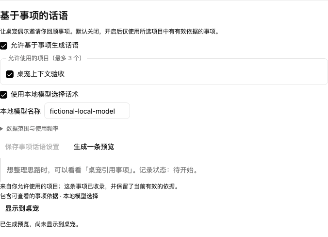
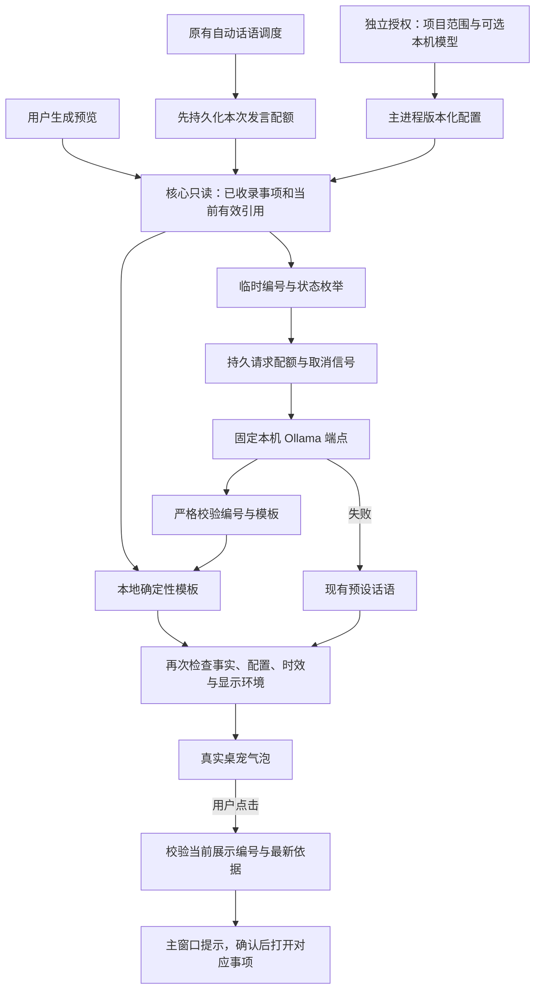

# 桌宠事项话语与本机模型选择

2026-09-13，PET12。本批让桌宠引用用户允许的真实事项，并能回到对应事项。自动话语的原有开关、冷却、每日六次上限、静默和系统抑制继续生效。

## 用户流程

设置中的「事项话语」独立默认关闭，项目范围默认空，最多选择三个项目。开启后，系统从已收录、未归档且有当前有效引用的事项中取得最多三条事实。标题和记录状态由本地数据库提供，不根据最后活动时间推断进度或催促用户。最近提到的事项会避开；没有新候选时穿插预设话语，重启不清除这项去重记录。

可以先生成一条预览，再明确选择显示到桌宠。气泡说明为何提到此事项；点击查看后主窗口提示打开准确事项，用户确认后才切换。草稿按事项暂存在窗口内，最多二十项，不写入额外磁盘文件。草稿保留事项、人工修改和条件三个基准版本；事项已变化时先展示冲突并暂停草稿提交，用户明确核对后才可继续，提交仍携带基准版本校验。引用过期、事项归档或依据失效时，旧气泡不能继续导航。

主设置预览与引用凭证有效期为六十秒，单次显示后不能重用。桌宠窗口仅收到展示文字、说明和不透明展示编号，不获得项目 ID、事件正文、文件路径或通用工作区调用能力。

## 可选本机模型

默认使用本地固定模板。用户可另外启用本机 Ollama 并填写已经安装的模型名。程序仅访问固定的 `http://127.0.0.1:11434/api/chat`，不接受自定义地址，不读云凭据、不自动安装或下载模型，也不在失败时转向云服务。

模型只收到本次临时编号和状态枚举，返回受限的编号与模板选择。事项标题、来源原文、作者和真实项目标识均不发送给模型。最终事实句与解释由本地渲染，模型的自由文字不会出现在气泡中；这项能力是模板选择，不是自由生成的个性话语，也不等于通用事项语义提取。

协议使用非流式聊天和 JSON Schema 输出，收到后仍做本地严格校验。依据 [Ollama Chat API](https://docs.ollama.com/api/chat) 和 [结构化输出说明](https://docs.ollama.com/capabilities/structured-outputs)。回环地址本身不能证明服务内部绝不联网；用户应使用本地模型及本地运行配置，已知 cloud 模型命名被拒绝。

单请求二十秒超时、16 KiB 请求、64 KiB 响应、128 输出 token 参数和单并发。所有模型尝试（含手动预览）共用持久的每日十二次上限与十秒最小间隔；先保存配额再请求，失败、取消和重启不返还已预留次数。日期采用 UTC，不因系统时钟回拨补发或刷新预算。这是本机资源上限，不是云费用保证。

## 实现与一致性

沿用生产数据库 v18，无影子任务数据库和模型直接写事项。事实证明绑定事项三个版本、有效引用/确认、来源授权版本和内容集合；人工与规则引用均通过已有版本复核、撤回和项目隔离检查。每次候选读取扫描最多一百个已收录事项、每项最多六十四个引用，选取最多三项，不承诺遍历整个项目。

`pet-context.json` 仅保存配置、请求配额、时钟和最多四个最近事项 ID；不保存提示词、响应原文或标题。生成与展示记录短暂保存在进程内。配置修改先取消旧请求，保存期间禁止使用旧配置启动新请求。异步请求返回后、显示前、点击前都重新校验；关闭、取消、隐藏、休眠和免打扰抑制不能误触发回退话语。模型失败可回预设，但取消没有回退投递。

## 验证与边界

最终 `pnpm check` 通过：类型与包边界检查、1,536 个单测（78 个文件）、26 组生产 SQLite 集成检查与独立基础库 42 个场景、34 个桌面测试。既有原生鼠标穿透和 30 分钟浸泡测试按条件跳过，未计为通过。新增真实 Electron 流程覆盖匿名模型请求成功、非法结果回退和取消、真实 Haru 手动与自动气泡、准确导航、不抢焦点、草稿恢复，以及草稿过期后的冲突阻止和明确核对。自动调度使用可控时间推进，未声称等待了 45 分钟墙钟时间。

本机安装了 Ollama CLI，但当前模型列表为空。使用生产请求适配器向本机服务发送仅含合成临时编号的缺失模型请求，确认返回安全的「模型不可用」错误；未下载模型，也未验证真实模型的生成质量。成功、非法结构与取消路径通过隔离网络边界的生产链测试验证；这些证据不替代 D06 的同集模型质量、成本和延迟评测。

本批不声称完成通用承诺/进展提取、云推理开关与账单预算、TTS、口型、任意模型网关或 Windows 实机验收。
