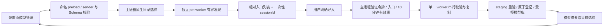

# 第十一批：桌宠模型管理

设置页新增「桌宠模型管理」。用户选择包含 `.model3.json` 的目录，选择入口并明确导入；导入只登记受控副本，需另行设为当前模型。支持重复提示、清除当前选择、移除副本和重启恢复。移除不会删除用户原始目录。

这次接通 PET02/PET03/PET04 的应用入口。导入通过不表示 Cubism 能渲染，当前不创建桌宠窗口，也不播放动画或主动说话。PET01/PET05/PET06 等仍需真实 SDK 与模型兼容性验收。

## 架构与授权

模型管理请求在主进程处理，SQLite core 不接受这些方法。Renderer 不能指定绝对目录或读取任意文件；未实现的 pet.show/pet.hide 仍拒绝。发现、校验和复制均由独立 utilityProcess 执行。主进程与 worker 双向检查协议，模型摘要不含资源明细、绝对路径或目录授权。错误只包含固定码、相对资源名与安全提示。

新目录选择、取消和模型变更会撤销未消费的导入会话；发现结果不会在取消后恢复旧授权。令牌单次使用、10 分钟过期，时钟回退也失效。操作互斥，选择阶段允许取消；已经交给 worker 的复制不能通过关闭设置页回滚，但不会自动改变当前模型。

目录扫描使用流式 opendir，不跟随符号链接；最多深度 4、512 个目录、4096 个条目、128 个入口，超限明确拒绝。验证与复制继续执行路径、哈希、资源与容量限制。便携 Node 文件 API 不是抵御恶意同用户进程持续替换祖先目录的系统沙箱。

worker 最多等待 8 个请求，启动等待 5 秒、请求 30 秒超时。超时或异常协议会终止拥有存储的 worker，停止接收操作；需重启应用并重新读取状态。错误不承诺写入未发生，原子存储恢复负责区分已登记模型和 staging。不会静默启动第二个存储写入者。

注册表原子替换是逻辑提交点。提交前错误保留原选择；提交后的同步错误明确报告 PET_OUTCOME_UNKNOWN，界面清理会话后读回真实状态，不盲目重试。逻辑移除后的资源清理可留待下次恢复，清理异常不会谎报逻辑移除已回滚。另以真实 Electron worker 验证 staging 出现后 SIGKILL、重启恢复及旧选择保留；提交前/后的注册表和同步故障由定向故障注入测试覆盖。

## 验证范围

新增真实 Electron 流程测试，使用临时目录和合成资源，通过实际 preload、主进程、worker 与受控存储。覆盖多入口导入、显式选择、重复去重、旧令牌拒绝、取消、缺失资源、重启恢复和界面移除；验证数据不带绝对目录，模型操作后事项核心继续可用。宽窄窗口检查使用当前 Kumo 封装和紧凑偶数间距。

合成 `.moc3` 仅包含格式头，用于验证文件管理，不是合法可渲染角色。SDK 兼容性测试仍需独立资产与许可，跳过的测试不作为通过证据。当前资源预检限制沿用已有实现（单文件 32 MiB、总计 128 MiB、最多 256 个资源；纹理限制及 PNG 支持范围见 model-validation）。

最新本机验证：898 项单元、7 组 SQLite、9 项桌面测试通过，另 2 项 SDK 资产测试跳过。删除模型存储、模型校验及领域模块的同名旧 JavaScript 生成副本，新增源文件重名检查，确保测试和构建加载当前 TypeScript。
