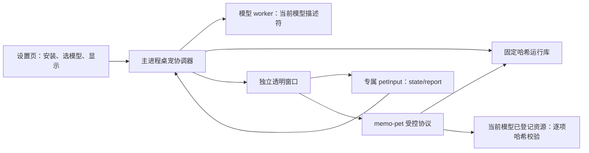

# BUGU 桌宠独立窗口与真实渲染

本批交付 PET05 的独立窗口与 PET06 的基础渲染部分。用户安装受支持的本地运行库、导入并选定模型后，可以显示真实 Live2D 桌宠。默认隐藏、不置顶，通过 `showInactive()` 显示；关闭主工作区到托盘时桌宠独立运行，应用退出统一释放。

## 使用

1. 执行 `node scripts/fetch-pet-sdk.mjs`，从固定官方 SDK 包生成 `.pet-sdk/runtime`。
2. 在设置中选择该运行库目录，再导入 `.model3.json` 所在目录。
3. 设为当前模型，点击“显示桌宠”。隐藏、切换或移除模型会销毁旧窗口；新模型需显式显示。

运行库安装只接受仓库固定清单的 19 个文件，逐项校验大小、SHA-256 和符号链接，暂存后原子发布。安装后的文件在应用私有目录。SDK、Haru 模型不提交仓库，也不进入应用安装包；许可边界继续由 PET15 跟踪。

## 数据与权限边界

桌宠窗口使用独立内存 session、sandbox、context isolation 和单独 preload，没有 `window.memo`、Node 或主工作区能力。IPC 校验发送窗口、主 frame、精确页面 URL、参数数量与当前模型 ID。模型只暴露不含绝对路径的 ID 和入口；资源必须在 worker 描述符中。拒绝模型 HTML/JS/SVG、越界与任意网络访问。

开发服务器是主进程固定配置的开发例外，只允许该 origin；生产只使用 `memo-pet://app`。没有为 SDK 放宽 WebAssembly CSP。

## 渲染与退出

通过固定 Cubism Framework/Core 加载 MOC3、纹理、Idle 与可选 physics。没有 Idle 时只驱动模型已有的呼吸、眨眼参数；不绘制替代角色。模型按照几何范围等比例放入窗口，活动渲染最多 30fps。

窗口隐藏、模型变更和移除直接释放旧 renderer/GPU 上下文。显示请求可取消，重复显示不重新初始化。运行库缺失不会创建窗口；模型加载失败留下设置页错误并销毁故障窗口，避免 SDK 不能取消的异步 shader 请求长期持有已释放对象。崩溃不影响主工作区，用户可以重新显示。

## 验证与范围

本机 macOS arm64、Electron 44.3.0、Chromium 152、WebGL2，使用官方 Haru 真实模型验证：导入、安装、非透明绘制、动画帧推进、隐藏重开、模型切换与删除；合成坏 MOC3 明确拒绝，错误窗口销毁。设置界面按 1440px 和 880px 宽度走查。测试数据、模型和安装均位于独立临时目录。

本轮 `pnpm check`：932 项单元测试、7 组 SQLite 集成检查、13 项桌面测试通过；追加主窗口关闭到托盘后的独立运行断言也已通过。

CI 不下载 SDK；无本地 SDK 时真实 Haru 用例跳过，窗口/协议/资源安全单测及缺少运行库用例仍执行。真实模型本地通过不能替代 Windows、多屏、休眠恢复和长时间能耗验收。

PET06 尚需模型内表情与动作选择、动作结束回待机的完整调度。PET07/08 拖动、缩放与穿透入口，PET09–11 主动气泡，以及 PET14 的 30 分钟性能与恢复验收仍未完成。
