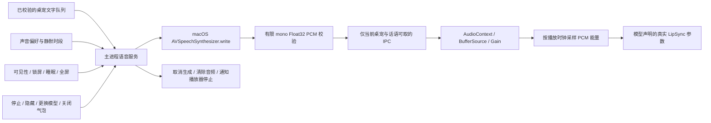

# 桌宠系统语音与口型联动（PET13）

用户在设置中选择系统声音并开启后，桌宠从下一条文字气泡开始播音。音量和语速可调，气泡和设置页都能停止播音；停止保留文字，轮询不会重播同一条。默认关闭，未选择声音不会开启。

## 实现与边界

- 主进程只朗读当前已验证队列的文字，渲染器不能传入任意合成文字、路径或地址。文字最多 240 个 Unicode 码点。
- 原生进程仅调用系统缓冲输出接口，音频实际播放由桌宠 AudioContext 负责；不采集麦克风、不下载声音、不调用云服务。
- 系统只枚举本机报告的声音；macOS 之外显示不可用，保留文字。语音资源不可用、生成或播放失败均降级文字。
- 每次生成和领取音频绑定当前话语 ID 与运行代次，配置保存使用版本比较。停止、取消、配置变更后迟到结果不能播放。
- 生成子进程有 20 秒上限，PCM 最长 12 秒且必须为有限数值；气泡原有 12 秒生命周期继续约束本次播音，超时取消。音频自然结束不会提前关闭文字。
- 音频能量按真实播放时钟、样本与音量计算，仅写入模型 LipSync 组声明且存在于 Core 的参数；没有参数时仅播放声音。停止会清除覆盖值。
- 语音遵守已有静默时段、暂停与系统状态。活跃时每秒复核，系统锁屏/睡眠事件即时取消；全屏由系统探测提供。设置变化从下一条气泡生效。
- 磁盘只保存声音偏好，不保存生成音频或话语正文。原生助手随桌面应用构建，打包后从解包目录执行。

## 验收

真实 macOS 系统声音经生产 provider 生成中文 PCM：22050 Hz、41186 帧、约 1.87 秒，峰值约 0.547。该探测没有扬声器播放。桌面验收使用 `--mute-audio`，检查真实 AudioContext 播放状态、Haru 参数变化、停止保留文字与不重播。单测覆盖输入边界、取消、超时、失效代次、设置冲突与无口型参数降级。

完整检查和打包结果在本次 PR 中记录。静音测试不能证明扬声器听感；Windows 实机、签名发布及 Live2D 正式分发许可仍由相应未完成需求跟踪。

本机静音桌面验收连续采集 16 帧：Haru Core 参数索引 23 从约 0.00278 变化至 0.27016，与 PCM 能量值一致。

