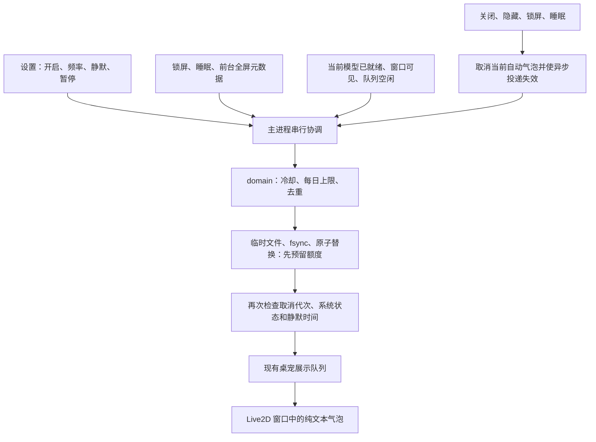

# BUGU 桌宠自动话语与免打扰

本批接通 PET10、PET11：用户在设置页开启自动话语后，当前桌宠偶尔显示一条离线预设文字。默认关闭，不播放声音，不引用未经核验的事项，也不根据用户沉默判断事项完成。

## 策略和设置

普通频率为 45–90 分钟随机间隔，较少频率为 90–180 分钟，每个本地自然日最多预留 6 次。10 条本地话语避开最近 4 条，额度、近期话语、下次时间和偏好写入独立的 `pet-speech.json`。开关、频率、静默时段及暂停在重启后保留。

默认本地时间 22:00–09:00 静默，可修改；起止相同时全天静默。提供暂停 1 小时与恢复入口，宿主拒绝超过 24 小时的暂停时间。关闭时取消主动话语的定时器、环境轮询和当前自动气泡，手动预览仍可使用。

不可见、锁屏、睡眠、全屏、其他展示占用或环境未知时不投递。重新显示、唤醒、解锁、结束静默/暂停后重新计算完整冷却；启动、时钟倒退、跨日及超过 5 分钟的漏轮询也不补发积压。回拨日期不会恢复已消费的当天额度。

## 实现与失败边界

策略位于平台无关的 domain 模块，时钟、本地日期和随机源可注入。主进程作为唯一持久化和展示协调者，连接系统状态及现有受限队列；renderer 只接收经过验证的气泡。这里不创建第二个调度器或在 renderer 计时。

持久化成功才展示；写入失败或损坏记录会停止自动投递并显示错误。崩溃发生在预留成功、展示之前时，该次额度仍保留，优先防止重启重复发送。保存和系统探测期间进入静默时段也不会发出原来的话语。手动气泡与主动话语共用现有队列，但取消主动话语按内部随机 ID 操作，不删除用户排队的手动内容。

## 系统适配与构建

macOS 使用 Electron powerMonitor 接收锁屏、睡眠与用户会话事件。一个随应用构建的 Swift 小程序只读取前台应用 PID、窗口层级和边界，与屏幕边界比较；不读取标题、截图或请求辅助功能/录屏权限。窗口覆盖整个屏幕按全屏处理；无法判断时保持抑制。

`build`、`dev`、`package:dir` 会编译该程序，输出在 `out/native`，打包时置于 asar 外。固定可执行路径、无用户参数、2 秒超时、1 KiB 输出上限。默认关闭时不启动定时探测，开启且桌宠可见后才轮询。其他平台暂不自动发话；Windows 系统适配和设备验收继续跟踪 PET16。

## 验证

策略测试使用可注入时钟覆盖随机间隔、额度、去重、重启、倒退、跨日、五类抑制与恢复。服务测试覆盖写入失败、等待写盘时关闭、跨静默边界和配置对象快照；存储测试覆盖重开恢复、权限、损坏、大文件及符号链接拒绝。

macOS 原生验证脚本 `node scripts/test-pet-speech-environment.mjs` 创建独立空白窗口，实际进入与退出全屏，探测结果依次为 false、true、false。设置端到端测试不依赖 SDK，验证交互、持久化及宽窄窗口布局。真实 Live2D 自动话语用例使用隔离测试进程的可控时钟加速冷却，实际模型、展示 IPC、气泡和本地持久化仍走生产实现；这不是实际等待 45 分钟的长时性能测试。

长时能耗、锁屏设备实测、多屏与 Windows 的完整矩阵继续由 PET14、PET16 验收。SDK 与模型的发布许可边界沿用 PET15。

本机 macOS arm64 最终结果：完整 `PET_OS_POINTER_TEST=1 pnpm check` 通过 1040 项单测、7 组 SQLite、18 项桌面测试。复审补充的失败停止监测与崩溃通知回归通过（18 项相关单测），4 项实际桌面复验通过，TypeScript 与 `pnpm package:dir` 通过。安装包中的 asar 外 Swift 程序可独立执行；SDK/模型资产未进入安装包。
