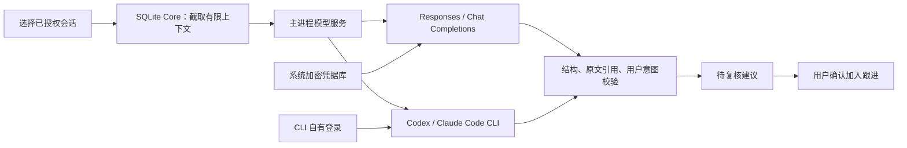

# BUGU 模型服务接入

## 产品入口

连接 → AI 事项分析 → 分析模型。默认收起，初始关闭调用授权。

| 接入方式 | 配置 | 验证状态 |
| --- | --- | --- |
| OpenAI Responses API | HTTPS Base URL（如 https://api.openai.com/v1）、模型、模型用途密钥 | 协议与隔离 HTTP 测试通过；未提供真实 API Key，未声称在线服务验证通过 |
| OpenAI Chat Completions API | 同上 | 协议与输出校验测试通过；未做真实 API Key 联调 |
| 本机 Codex | 已安装并登录，可选模型 | 本机 ChatGPT 登录 + 虚构需求实调通过，约 10 秒；BUGU 界面分析与原文展开也已实测通过 |
| 本机 Claude Code | 已安装并登录，可选模型 | CLI 已登录；此次虚构需求实调在 60 秒超时，尚未通过在线验收 |
| Kimi Code | 暂未开放 | 本机未安装；当前版本 CLI 的会话保存与无工具运行仍需验证，不作为已完成功能 |

这里的 Completions 指聊天模型使用的 `/chat/completions`，不是旧式文本 `/completions`。

兼容服务须支持所选协议和 JSON Schema 结构化输出。没有偷偷降级为自由文本或其他服务。密钥通过系统原生文件选择器导入单行 `.key/.txt/.token` 文件，系统加密保存；表单仅选择凭据引用。Base URL 须为 HTTPS、不含查询参数、密码或片段；只发送给与模型凭据域名一致的主机，不跟随重定向。

## 调用架构

Core 不持有 API Key，不再直接调用 Ollama。Core 发起后台模型请求，主进程执行网络或 CLI 调用，再返回正文及服务身份；分析流程不占用普通 IPC 的 3 秒等待。历史分析记录仍按当时模型显示，不冒充新服务输出。来源授权在持久化和加入任务前重新检查。

## CLI 边界

调用官方非交互模式，独立临时目录，提示通过 stdin 传入；不启动 shell 来拼命令，不提取 OAuth 令牌。Codex 使用 ephemeral、只读沙箱、关闭 shell、hooks、apps 与网页搜索，并跳过个人提示配置；Claude 使用 print、空工具集、空 MCP 配置、禁用 hooks 与会话持久化。使用 CLI 自身的服务与额度，不能把订阅登录当作普通 API Key。受企业管理策略和 CLI 版本影响的行为应在部署设备验证。

失败、超时及超出输出上限不会写入建议；关闭授权、修改配置、移除凭据和退出应用取消当前调用。凭据引用与模型配置不进入 renderer 的原始秘密字段。临时分析文件最终清理。

## 验证范围与未完成项

本次仅运行相关协议/分析单测、存储测试、桌面启动边界 E2E 和虚构会话实调。未发送用户真实个人会话。模型抽取仍为单个授权会话主动触发，尚未接通跨渠道自动归并或全历史批量模型分析。

Kimi 接口已调研，但未伪造已连接状态；需安装目标版本并验证禁用工具与会话持久化后再开放。桌宠的可选旧本地模板选择是独立功能，不代表事项分析的模型选型。之前 Qwen 评测和路演 v1.1 属于历史版本，不应作为本次 API 联调证据。

## 官方参考

- [OpenAI 结构化输出](https://developers.openai.com/api/docs/guides/structured-outputs)：Responses 的 `text.format` 与 Chat Completions 的 `response_format`。
- [Codex 非交互模式](https://learn.chatgpt.com/docs/non-interactive-mode)：exec、结构化输出与临时会话。
- [Claude Code 程序化调用](https://code.claude.com/docs/en/headless)：print、JSON Schema 输出。
- [Kimi CLI 参数](https://www.kimi.com/code/docs/en/kimi-code-cli/reference/kimi-command)：非交互调用与会话行为，待本机实测。
