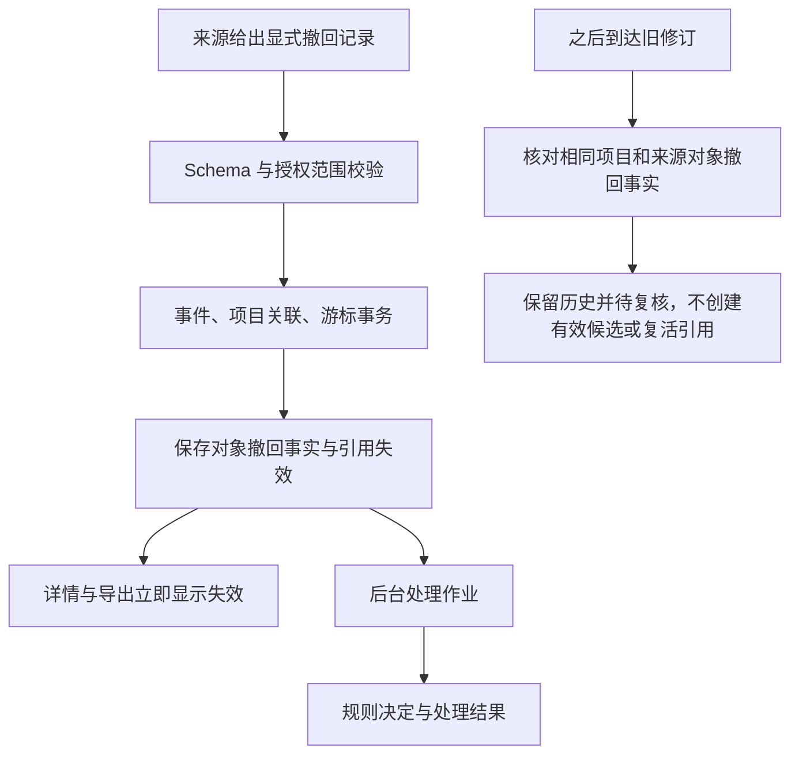
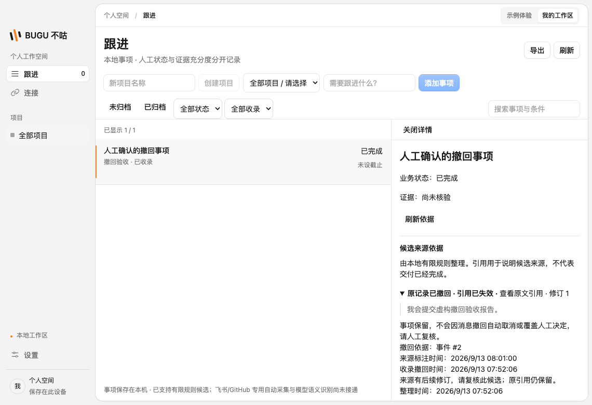
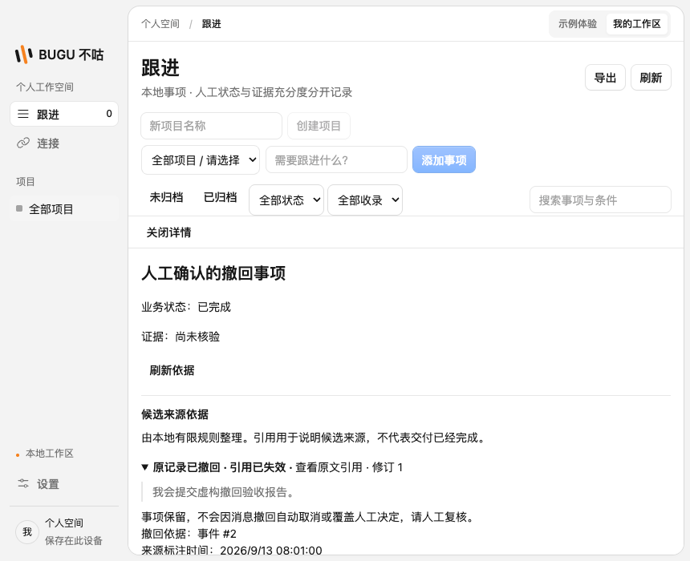

# 显式消息撤回与引用失效

本次接通结构化撤回记录、授权收录、引用失效、规则处理、详情与导出。消息撤回和来源停用是独立事实：停用只停止继续读取，不代表历史消息被撤回；明确撤回会使该来源对象的引用失效，但保留事项和人工决定。

## 标准事件

`SourceEvent` v1 增加可选 `operation`：`upsert` 或 `retract`，省略等同 `upsert`，原必填字段和严格校验继续生效。撤回必须使用空 `text`；普通空正文或文本中的“撤回”字样不会触发撤回。仍以来源实例、外部 ID、修订为唯一标识，相同修订的内容、角色、原始时间或操作冲突均拒绝。

本地 JSONL 支持：

```json
{"id":"message-1","revision":"2","created_at":"2026-09-13T10:00:00Z","role":"user","content":"","operation":"retract"}
```

内置文件读取保持旧映射身份与游标兼容。声明式本地/HTTP 插件只有配置 `mapping.operation` 时才读取该字段，不能把未知来源字段默认为撤回。飞书适配器只将明确的 `deleted: true` 映射为撤回，不依据正文猜测；撤回使用稳定操作后缀，避免上游更新时间未改变时与旧消息冲突，长修订采用哈希保护。旧 upsert 修订不变。

## 数据流



引用失效不等待后台整理启用。原始内容和人工历史保留，不把撤回当成安全擦除；本次不自动取消事项、修改人工标题或完成状态。来源实例和项目共同隔离，另一个项目或来源的同名对象不能影响当前引用。

同一对象收到明确撤回后，后续普通 `upsert` 不能自动恢复引用。当前没有自动“恢复已撤回消息”的协议；不借到达顺序判断外部事实已恢复。普通编辑目前保留修订待复核，完整编辑证据重评仍需后续实现，不能将本次撤回交付等同全部 F04 完成。

## 导出与展示

详情区独立显示消息撤回、引用失效和来源授权状态，提供撤回事件、来源标注时间和本机收录时间。来源标注时间可能是平台原消息创建时间，不冒充精确撤回时刻。刷新依据不覆盖当前编辑草稿。

导出 schema v3 保留原有字段，增加操作、失效状态、撤回依据及引用影响记录。即使后台处理暂停，撤回依据事件也包含在导出引用集合内；关闭包含原文时不输出事件正文及引用文本。跨项目或损坏的撤回依据不能导出为可信结果。

## 能力边界与验证

这是对**已能读取到的明确撤回记录**进行一致处理。产品尚未提供飞书专用授权与持久调度界面，平台不可见的撤回无法凭空补齐；本地测试不会被描述成真实飞书账户验收。

完整 `pnpm check` 通过：1173 项单测、12 组 SQLite 集成、22 项桌面测试；原生指针和 30 分钟耐久两项专项按原配置跳过。审查补充精确引用的持久状态/撤回证明一致性校验后，12 组 SQLite 再次通过；最终构建的撤回桌面回归再次通过，截图已更新。另修复预算测试的窗口导航等待，首次启动与重启均等待页面就绪再调用 bridge，连续三次通过；测试截图写临时结果目录。

验证包括：旧 JSONL 游标续传、显式操作校验、飞书相同更新时间撤回修订、立即引用失效、十次重复撤回、撤回先到与迟到旧修订、人工事项快照不变、事务中断回滚、跨项目隔离、受损撤回依据拒绝、导出原文选项及规则审计、宽窄窗口与编辑草稿保留。




