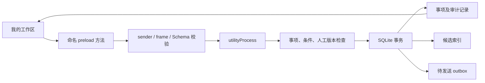

# 第二批交付：真实工作区与模型导入存储

2026-09-13，基于已合入 PR #4。三个 agent 分别实现 S02、S07、PET04，主 agent 接入真实工作区并集成验证。

## 已交付

- S02：SQLite v3，项目、收录决定、条件版本、证据关系、人工决定、字段覆盖、事项修订和待发送 outbox。复合外键限制跨项目引用；更新同时比较事项/条件/人工版本；事务同步候选搜索索引。旧事项不虚构项目归属，保持未分配，支持存储 API 显式分配。
- S07：身份以来源实例、命名空间、主体 ID 和项目构成；显示名不作为合并依据。时间保留原文、发生/接收时间、offset 与纳秒精度，可核验来源 IANA 时区。迟到旧计划不覆盖，同时间冲突或修订顺序不明需确认。
- PET04：ModelStore 实际执行有界复制、SHA-256 比对、私有 staging 重验、原子资源发布和注册表写入。支持重复提示、显式选择、移除、半成品清理；失败保持当前模型，损坏注册表保留数据并报错。最多 64 个模型、注册表 8 MiB；沿用 PET03 文件及纹理限制。
- U01/H01 部分：我的工作区新增真实项目与手动事项；列表、标题修改、五种业务状态、归档/恢复通过受控 IPC 持久化。人工完成不伪造证据；归档不修改业务状态；示例数据不写真实库。

## 数据流

## 验证范围

包边界、类型检查、单元测试、四组真实 SQLite 集成及三组 Electron 端到端测试。测试覆盖旧库迁移、跨项目外键、条件历史、索引失败回滚、人工审计、版本冲突、真实窗口非法 IPC 拒绝、事项重启恢复，以及模型源资源变化和半成品恢复。真实界面保存宽窄截图并走查。

## 仍未完成

S07 纯规则尚未接 SourceEvent 和生产计划更新。PET04 必须由单一 owning worker/utilityProcess 使用，当前没有导入 UI、跨进程锁、SDK 或真实渲染；不能将预检视为 SDK 兼容承诺。用户目录中的并发恶意替换不作为完整沙箱保证，复制后在私有目录重验。

工作区每项目最多显示 100 条，尚缺分页、来源/活跃度筛选、条件/截止编辑、人工撤销、关联与自动判定。legacy 事项只能展示，分配项目 UI 未接入。outbox 仅持久记录，尚无通知配送。来源采集和模型调用均未启用。
