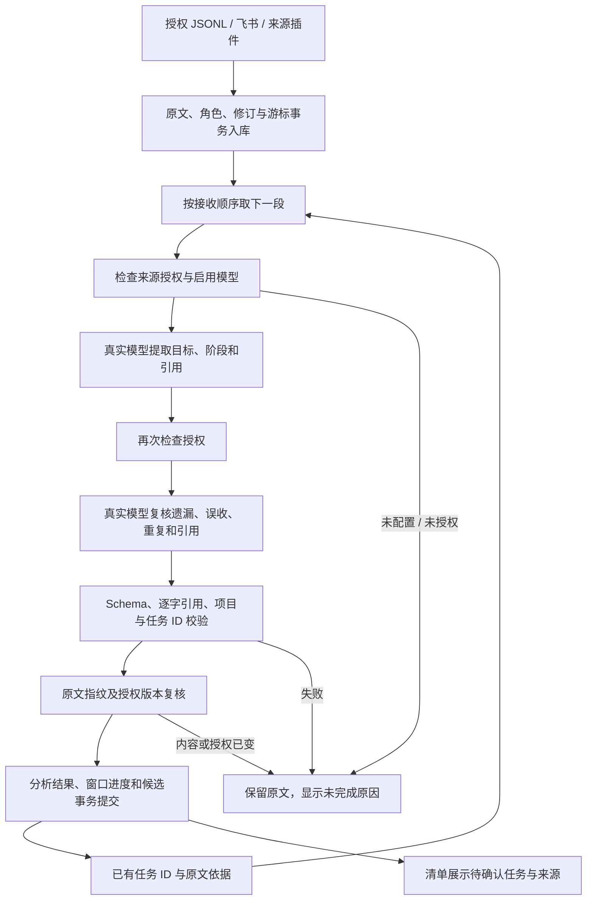

# 真实模型任务提取与分段复核

日期：2026-09-15。提取协议：`task-analysis-v3`。数据库迁移：v25。

## 产品行为

授权接入本地会话、飞书或来源插件，并启用 AI 模型后，后台自动发现需要跟进的任务。清单显示待确认事项及来源，详情展示原请求、进展与验收引用。没有配置模型、模型失败或来源授权失效时，不生成替代任务。

已删除 `packages/domain/src/commitment.ts` 的明确承诺规则提取器、未接入生产的进展关键词原型，以及来源处理事务中的候选创建代码。来源处理现在只负责接收、修订、撤回和已有引用的观察。保留历史规则记录的读取与导出，以兼容已有任务；测试中的旧数据夹具只模拟升级前已存在的记录，不参与提取或准确率计分。

## 处理流程

每段先提取，再由同一启用模型独立复核。复核仍可能出错，不采用多数投票或规则兜底。模型输入没有评测答案、目标关键词或评分器。示例、代码、转述、假设中的承诺不能变成现实任务；同一交付物的实现、测试和反馈步骤合为一项，独立交付物分别收录。模型逐目标判断阶段，避免“一项验收、另一项未开始”互相影响。

## 长会话、身份与重放

旧实现只取最后 64 条消息。新实现从头分页，每段至多 48 条新增消息、24,000 个字符，并带上最多 12 个已有任务及其真实原文依据；合计最多 64 条、65,536 字符。还携带边界前最近 8 条消息，覆盖跨片段采纳建议的场景。

模型通过 `existingTaskId` 指向同来源、同项目且具有原文依据的已收录任务。代码核验 ID 是否在本轮记忆中，并要求保留最初用户请求的引用。后续进展更新分析建议，不覆盖人工标题、业务状态或收录决定。重放同一结果不会再次创建任务。

窗口同时记录起点、终点和输入指纹。分析过程中新增消息不会让已处理的固定前缀失效；重启从尚未处理的片段继续。授权版本或原文修订变化会使过时结果失效。v25 只增加窗口表与索引，不删除历史任务。

## 错误与控制

- 暂停后台整理会停止后续调度、取消在途请求并拦截迟到结果。启用模型与来源授权都是必要条件。
- 提取、复核共用 60 秒截止时间；后台串行处理，每小时最多完成 12 段，失败后退避。两遍模型调用会增加成本与延迟。
- 单条消息超过本段预算时报告 `ANALYSIS_MESSAGE_TOO_LARGE`，不静默切掉后半段。任务记忆超出预算时返回覆盖不足标记，评测不判定达标。
- 结构与引用校验不证明语义正确。`accepted` / `cancelled` 只是模型阶段建议；来源仍需可追溯，模型不能直接将任务业务状态改为完成。
- 已完成输入缓存避免重复请求；模型或服务失败仍保留原始输入，不回退到正则、关键词或伪造响应。

## 验证与边界

运行方式、计分口径与原始报告见 [JSONL 本地评测](../evals/JSONL任务提取本地评测.md)。验收要求精确率、召回率和会话完全正确率分别达到 99%，并且没有模型错误、遗漏覆盖或写入不变量失败。

本轮评测范围是合成 JSONL 的任务与进展提取，包括四种格式、无任务对照、重复请求、多目标和长会话。尚不证明真实个人会话达到 99%，也不证明跨渠道自动归并、任意长会话、截止时间识别或工具执行真实性。任务记忆与单段输出有明确上限；大量独立任务、很长的单条消息和跨会话关联仍需要进一步评测与扩展。

设计参考：OpenAI 的[评测实践](https://developers.openai.com/api/docs/guides/evaluation-best-practices)建议使用任务专属指标、固定数据和持续评测；[结构化输出文档](https://developers.openai.com/api/docs/guides/structured-outputs)也明确结构正确不保证内容无误。这里据此将结构/原文验证、语义评分和实际入库分别检查。

## 集成检查发现并修复的问题

自查按 Code Review Expert 的授权、事务、重放与错误处理清单进行。E2E 发现主进程仍使用旧存储 Schema，现已改为严格的 `taskExtractionSchema`，并用主进程桥接测试防止评测与产品配置分叉。提取及复核前分别验证授权；模型分析与窗口记录原子保存，写入失败不会留下半条分析；过长输入的错误不再被调度器吞掉。

类型检查、包边界、111 项相关单元测试、18 项相关存储集成入口和 8 个桌面 E2E 已通过。E2E 的四种来源格式均由真实 Codex CLI 模型提取，未声称评测过其他提供方的语义质量；Responses 与 Chat Completions 的请求结构、取消与授权用本地服务器测试。没有运行全部 E2E，也没有新增 CI。
