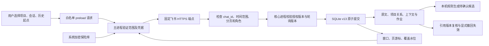
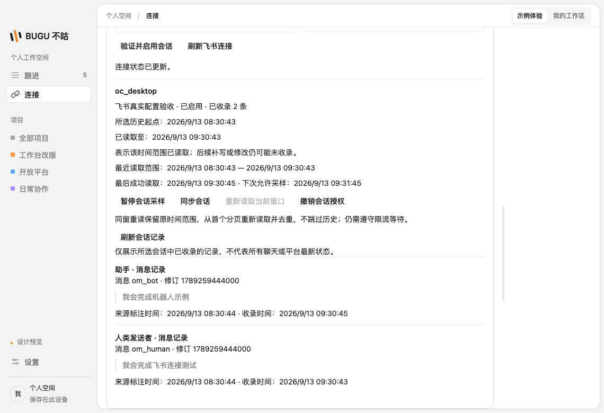
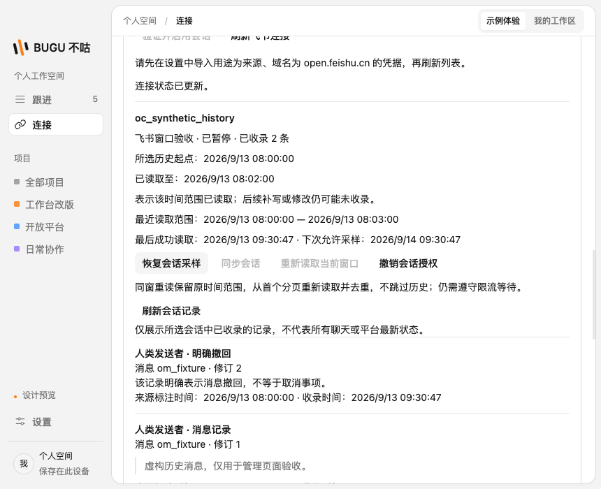

# 飞书限定会话与持久历史采集

日期：2026-09-13。对应需求 F01、F02、F03；延续 F04 已有的可见编辑及显式撤回处理。

## 本次交付

连接页支持选择项目、保险库中的来源凭据、明确的 `oc_` 会话 ID 和本机时区的历史起点。宿主用实际凭据验证所选窗口的第一页，只有成功后才创建连接。令牌仍留在主进程保险库，数据库只记录凭据引用；设置中移除凭据时先取消进行中的验证与采集，暂停相关连接，再删除密钥。

这是一条可以从桌面表单配置并持续采集的链路。用户需自行准备有权读取指定会话的有效访问令牌；本次未实现 OAuth 登录、应用创建、令牌自动刷新、可选会话发现或全租户读取。

## 范围与数据流

API 请求限定 `open.feishu.cn` 的会话历史消息接口，显式使用 `ByCreateTimeAsc`、每页最多 50 条；每一条返回消息必须属于选择的会话、创建时间位于固定窗口内。角色仍区分人、机器人和未知主体；机器人输出不进入人类承诺规则。未知返回内容和错误正文不能成为授权、完成指令或错误展示文本。

## 可恢复窗口

首次从用户下界开始，以最多 24 小时窗口读取。窗口内所有页使用相同起止时间，失败时保留原窗口和页游标；一页的原文、项目关系、作业、引用变化、游标和成功时间在同一事务提交。授权版本和轮询版本共同拒绝撤销后的结果、过期失败及重复提交。

读到末页才将覆盖水位推进到窗口结束时间，即使窗口没有消息也会推进。下次窗口从已覆盖水位之前 120 秒开始重叠读取，修订标识去重，随后推进下一段；断网或退出后继续尚未完成的窗口，不按“最新一条消息时间”跳过剩余页。追赶时下一页最早 1 秒可读，接近当前时间后间隔 60 秒；实际执行还受宿主调度、同凭据单飞、暂停和冷却限制。

SQLite 保存当前窗口已见的页令牌，重启后仍拒绝 A→B→A 循环。每窗口最多 10,000 页；检测循环或达到页数上限后等待人工处理，不不断联网重试。用户可“重新读取当前窗口”，保持原起止范围，仅清理分页位置并增加退避；这不是跳过窗口或扩大授权。超大窗口仍可能再次触及上限，本次没有自动二分窗口。

## 失败与用户控制

- 凭据失效和权限不足显示不同的固定错误，未知 API 错误不猜测为“游标失效”。
- 网关等待秒数与标准 Retry-After 以较长有效等待为准；共享凭据的验证和轮询遵守持久冷却，不因重启或点击同步而绕过。
- 队列和磁盘预算不足时先停止新增读取；已收录作业可继续消费，失败页不前移。
- 暂停、恢复、撤销均保留历史原文。撤销后重新授权产生新连接标识；删除凭据同时遵守 GitHub 和飞书连接的取消保护。
- 记录页展示原文、角色、修订与明确撤回，采用有界分页；连接卡展示当前窗口、已覆盖时间、最后成功收录和下次可读时间。

## 验证方式与实际边界

单元测试使用合成 API 返回，覆盖窗口越界、错会话、角色、固定错误、限流、循环、取消和运行时调度。SQLite 集成测试使用 Electron 自带 Node 与隔离数据库，覆盖迁移、重启续页、双版本校验、事务回滚、背压、候选消费及引用变更。桌面全配置测试使用真实 main/preload/core/SQLite/系统加密路径，只在测试进程的 DNS/HTTPS 边界返回虚构消息；不访问私人聊天、不导入真实令牌。另有预置连接的界面管理测试，其覆盖范围不替代全配置测试。

采样依据消息创建时间。超过重叠窗口的旧消息在之后发生编辑或撤回，不保证被此轮询发现；只有再次读取并收到的变更才能触发引用处理。窗口覆盖表示接口在那次读取返回的记录已处理，不保证平台未来补写的任意旧消息都能被发现。长时间迟到消息、事件订阅、指定旧消息重新校验和令牌续期仍需后续实现。

角色 `user` 代表飞书人类发送者，不等于已确认是本机用户本人；跨来源身份映射仍属 S07。现有有限承诺规则只生成待确认候选，不自动更新人工事项为完成。

本次无真实租户权限联调证据，不声称所有单聊或群聊均可读取；权限与数据可见性由实际令牌和飞书接口决定。

## 协议依据

核对官方 [Node SDK 历史消息字段与参数](https://github.com/larksuite/node-sdk/blob/main/code-gen/projects/im.ts)、[CLI 通用错误码](https://github.com/larksuite/cli/blob/main/internal/output/lark_errors.go) 和 [CLI 网关等待头解析](https://github.com/larksuite/cli/blob/main/internal/ratelimit/headers.go)。接口入口见 [飞书会话历史消息](https://open.feishu.cn/document/server-docs/im-v1/message/list)。本项目只调用读取接口，不使用 SDK 的自动重试或令牌管理能力。

## 本机结果

`pnpm check` 通过：1,347 项单元测试、16 组 SQLite 集成、28 项桌面测试；2 项原有条件测试跳过（原生鼠标穿透与长时浸泡条件，不计为本批通过）。真实配置测试确认两页消息收录、人类角色产生一个待确认候选而机器人角色不产生候选，以及删除凭据后连接暂停。管理页用合成预置连接验证恢复、撤销、原文/撤回展示和冷却期拒绝重读；它不冒充联网授权或成功重读验收。

最后界面文案调整后重新构建，飞书全配置及管理页 2 项桌面测试再次通过。

