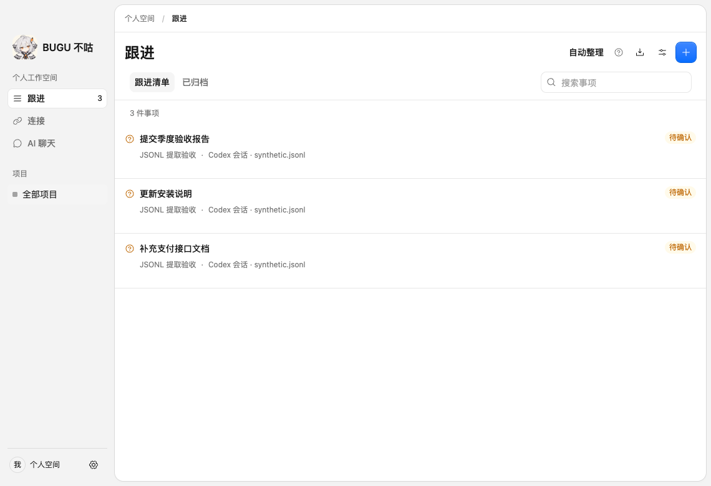

# 真实模型提取修复评测 · 2026-09-15

## 结果

原 60 个回归会话与新增 40 个验证会话分别完整运行，通过真实 Codex CLI 提取及复核，最终 82 个预期任务全部入库；误收、漏项、重复、错误阶段、缺少必需依据均为 0。精确率、召回率及会话完全正确率均为 **100%**，达到本地 99% 门槛。

这是固定合成语料的实测，不能声称真实个人会话已经稳定达到 99%。100 个不同合成会话全对时，Wilson 95% 区间约为 96.3%–100%；这一区间还不能消除合成分布与非独立标注的偏差。

| 数据与迭代 | 精确率 | 召回率 | F1 | 会话完全正确 | 误项 / 漏项 |
| --- | ---: | ---: | ---: | ---: | ---: |
| 旧生产链路：规则 + 模型（60 例） | 87.5% | 85.7% | 86.6% | 48/60 | 6 / 7 |
| 删除规则、补充上下文的第一版（60 例） | 98.0% | 100% | 99.0% | 59/60 | 1 / 0 |
| 加入模型复核的第一版（60 例） | 98.0% | 100% | 99.0% | 59/60 | 1 / 0 |
| 首次新增验证集（40 例） | 100% | 100% | 100% | 40/40 | 0 / 0 |
| 修正言语意图后的完整回归（60 例） | 100% | 100% | 100% | 60/60 | 0 / 0 |
| 同一版本再次验证新增集（40 例） | 100% | 100% | 100% | 40/40 | 0 / 0 |

原基准的 49 个目标和新验证集的 33 个目标分别达标，没有取两轮中各个案例的最好结果。此前两次失败保留：第一版将“修复后补测试”拆为两个任务；首次复核把“示例中的承诺”误收。根据原基准调整提示词后，重新运行全部 60 例与全部 40 例。评分器、原语料标注以及新增验证集均未按输出修改。

## 漏项与误项的修复

- 口语、日期前缀、列表、第一人称认领：由模型判断真实行动意图，明确用户自己的承诺也是待办；取消规则先建项，避免与模型重复。
- 长会话早期目标：从头分段，携带已有任务和原始引用，不再只取末尾 64 条；跨段更新使用已验证的任务 ID。
- 不同目标分别验收：移除按整段关键词拒绝模型阶段的逻辑，由模型逐目标判断；保留结构、逐字引用及人工状态保护。
- 修复与测试过度拆分：明确同一交付物的实现、验证与反馈属于一个目标，模型另行复核粒度。
- 示例误收：先识别外层言语意图；空草案可以正确，不能因为复核要求查漏而凭空补任务。
- 桌面主进程仍传旧 Schema：真实 E2E 发现后改为严格输出 Schema，并加入 IPC 主进程测试。独立评测通过不能代替实机链路验证。

## 复现与原始记录

```sh
pnpm eval:extract --live --suite baseline --output test-results/extraction/baseline
pnpm eval:extract --live --suite holdout --output test-results/extraction/holdout
BUGU_EVAL_LIVE=1 pnpm test:desktop tests/desktop/jsonl-extraction.spec.ts tests/desktop/processing.spec.ts
pnpm test:desktop tests/desktop/app.spec.ts
```

提供方为 Codex CLI 默认模型，CLI 版本 `codex-cli 0.154.0-alpha.6.2`。未读取模型登录凭据，未推测服务端实际模型名称。最终两组共 200 次模型调用；有调用的会话端到端耗时中位数约 16.7 秒、P95 约 22.6 秒。每段提取和复核各一次，共用 60 秒截止时间。纯助手/工具输入不请求模型，长会话可能需要多个片段，调用数逐例保存。

- [旧规则与模型基线](results/jsonl-v1-2026-09-15/codex.json)
- [第一版单遍原始结果](results/jsonl-v3-2026-09-15/one-pass-baseline.json)
- [首次复核原始结果](results/jsonl-v3-2026-09-15/reviewed-baseline.json)、[首次新增集结果](results/jsonl-v3-2026-09-15/reviewed-holdout.json)
- [本次完整 60 例](results/jsonl-v3-2026-09-15/intent-baseline.json)、[本次完整 40 例](results/jsonl-v3-2026-09-15/intent-holdout.json)

原语料 SHA-256：`6d95494307130e496475ef7f2c52b1a5a5b0cdafe7699f9b9e1f45c01a2a0fcb`。新增语料：`28f6c6f1bcafc31857e1bad35dc5bd85e3fe2ad3ff188e635cd0b374c8c8aa5c`。最终提取器代码：`065151dbf91d04102bff4a8fa7de1a830714ea816e6c980e6183ac6d77cfbb9c`。

报告保留各次启动时的代码哈希，评测脚本启动时打包生产代码。最终两组启动后，存储文件补充了分析与窗口的事务回滚保护、按时间顺序选择原请求；这两处另经存储测试和最终桌面 E2E 验证。模型提示词、上下文分页、标签和评分未变；没有修改原报告哈希来假装不同代码运行过。

## 集成验证

111 项相关单元测试、18 项相关存储集成入口、类型检查、包边界及构建通过。8 个受影响的桌面 E2E 通过，其中 5 个经真实模型调用：四种来源格式的授权入列/原文/追加/重放，以及行动请求的自动整理。其余验证未配置模型不创建任务、暂停重启、空工作区与核心隔离。修正了基础桌面测试仍期待已删除演示任务的旧断言。

所有入库事项保持候选，模型不自动完成业务状态。重复同步和写入重放不增项，背景新增不覆盖人工标题及未保存草稿，撤销授权后拒绝复核与过时结果。存储事务和异常边界的模拟模型响应未计入以上准确率。



## 覆盖边界

结果限定于四种 JSONL 格式和所列合成场景，未评测 Responses/Chat Completions 或 Claude CLI 的语义质量。新增 40 例也由开发代理编写，不是独立人工标注的真实用户集。暂不证明截止时间、负责人、跨会话/跨渠道归并、任意原消息改写后的重关联或交付真实性达到此分数。

当前有单段消息/字符/任务数和历史任务记忆预算。过长单条输入报错，记忆不足标记覆盖缺口；这些不能按已成功整理处理。生产可靠性下一步应通过经授权、脱敏、独立标注的数据按真实时间顺序验证，并继续保留错误、分母和不同重复轮次。
