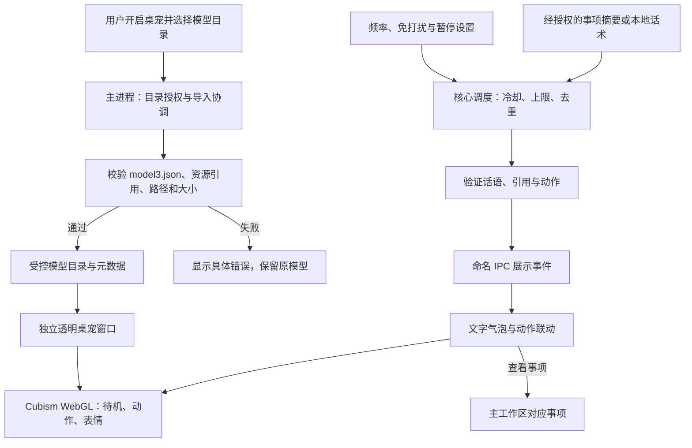

# BUGU 不咕 · Live2D 桌宠需求与架构增补

2026-09-12，新增需求，尚未实现。补充现有 PRD 和技术方案。产品名称统一为 BUGU 不咕；已有包名、IPC 协议和 appId 保持兼容，不把品牌更名等同于数据迁移。

## 要解决什么

让事项助手以轻量桌面伙伴的形式常驻，降低用户回到工作区查看进展的成本。用户可导入自己有使用权的 Live2D 角色，桌宠通过动作、表情和偶尔出现的话语提供陪伴。它不替用户判断是否完成，不以催促制造压力。

## 首版范围与体验

1. 用户主动开启桌宠，选择包含 `.model3.json` 的运行时模型目录。多入口时让用户选择，显示缺失资源与兼容性错误。`.cmo3` 编辑工程文件不直接支持；ZIP 导入另行评估，不默认为首版能力。
2. 导入经过路径与大小校验的模型，复制到受控目录；模型就绪后创建透明桌面窗口。用户可以拖动、缩放、切换角色、隐藏和关闭。
3. Cubism 驱动呼吸、眨眼、待机、表情与模型内动作。没有某项动作时回到可用待机，不展示假成功。
4. 桌宠偶尔用文字气泡说话，首版可用本地预设话术。例如“要不要看看今天还在跟进的事？”；只有具有有效依据时才引用具体事项。
5. 主动话语默认低频：建议间隔 45–90 分钟、每天最多 6 次，22:00–09:00 静默；以上为待试用调优的产品初值。用户可暂停、关闭或调整；锁屏、全屏演示和睡眠期间不发，恢复后不补发积压。首版默认不自动播音。
6. 气泡不抢键盘焦点，角色外透明区域允许鼠标穿透；保留主窗口中的关闭入口。多屏切换后角色必须可找回。

TTS、语音驱动口型、LLM 个性话术作为 P1。用户没有提供默认模型；仓库不加入来源不明模型，也不把占位动画称为 Live2D 支持。

## 技术选型与边界

优先验证官方 Cubism SDK for Web + WebGL，与现有 Electron/TypeScript 共存。具体 SDK 版本由 PET01 兼容性验证后锁定，不在本次需求提交里未经验证引入运行库。官方模型加载以 `.model3.json` 中的配置为入口，关联 `.moc3` 与纹理等资源，见 [About Models (Web)](https://docs.live2d.com/en/cubism-sdk-manual/model-web/)。

桌宠使用独立、透明、无边框的 BrowserWindow，与主工作区 renderer 分开。保留 sandbox、contextIsolation、命名 preload 和 sender 校验；只有主进程负责目录选择、资源复制、窗口位置和穿透开关。模型资源通过受控 ID 映射读取，不向 renderer 暴露任意文件路径。禁止模型包里的 JS、HTML、远程 URL 和越界资源执行或加载。

定时策略放在核心进程，保存冷却时间和当天计数，采用可注入时钟测试。桌宠 renderer 只消费已验证的展示事件，不修改事项业务状态。模型推理只能提交受限的文本与枚举动作建议，长度、引用、动作名和权限经验证后才送展示。

建议新增模型元数据、桌宠偏好和话语投递记录三类持久化实体；具体表结构和 Schema 在实现前评审。隐藏暂停渲染、模型切换释放纹理、WebGL 丢失恢复和窗口崩溃恢复均有独立需求；macOS 首验，Windows 的透明、穿透和多屏行为须单独验收。

## 验收与发布

多维表 PET01–PET16 是实施与验收入口，覆盖导入、真实渲染、交互、调度、免打扰、性能与故障。演示需从用户导入模型到主动气泡形成闭环；性能指标须带基准设备、模型规格与测试时长，不把规划目标写成已达到结果。

发布前核对 Cubism Core、Framework 与模型各自许可，以及适用的 SDK Release License 条件；不能从“源码开放”推断所有资产可随包再分发。参考 [SDK 发布许可](https://www.live2d.com/en/sdk/license/) 与 [官方下载入口](https://www.live2d.com/en/sdk/download/web/)。本次未下载或分发 Core、模型资产，未代表用户签署发布协议。
