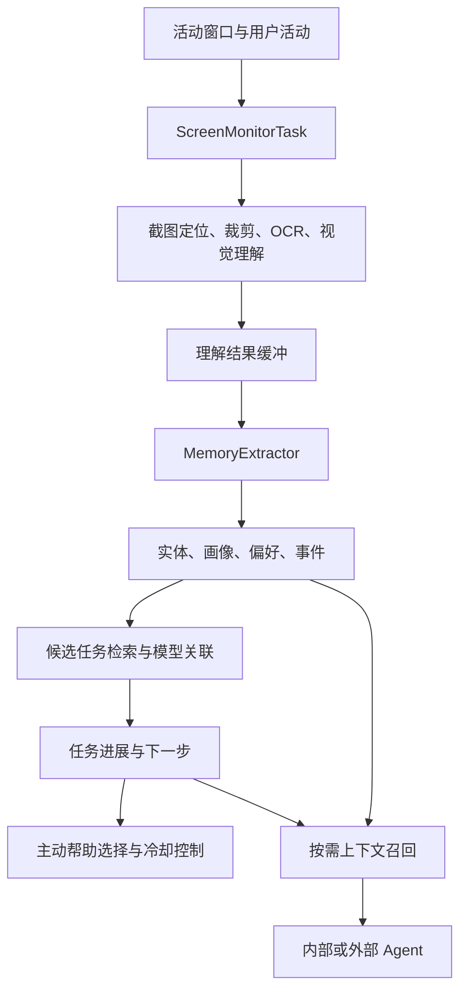

# AirJelly 实机与 MineContext 源码调研

日期：2026-09-12。功能基线：本机 AirJelly 2.0.0。主要开源参照：volcengine/MineContext，提交 `171c7a9ea8091e326ddcf0f10718aa1b58c83c65`。

## 1. 本轮明确的产品方向

按本次讨论，**功能与体验以 AirJelly 为基线进行扩展；MineContext 是主要开源竞品和架构参照。** 本项目的新增重点仍是用户可扩展的信源，以及承诺、执行、交付的持续关联。AirJelly 的功能基线不只指它的 Skills，也包括上下文采集、记忆、询问、主动帮助、日程和召回体验。

这会调整 v0.2 的竞品权重：先深入这两个产品，其他竞品作为特定能力的辅助对照。暂不把 AirJelly 全部功能搬进 MVP；保留完整参照地图，再按核心场景分期实现。

本轮已打开 AirJelly，查看通用设置、Skills、功能管理、召回与连接界面；读取了安装包元数据、打包 JavaScript 的相关实现和随应用分发的桥接文件。MineContext 已下载指定版本源码并读取核心链路。

**证据等级：**“界面观察”表示当前安装版本可见；“静态确认”表示代码存在、并尽可能检查了调用关系；“设计建议”是本项目判断。未执行动态 Hook、未抓取网络载荷、未修改应用设置、未安装技能、未改动 AirJelly 数据库，也未以真实任务测试准确率。当前会话未暴露用户提到的 JS Hook MCP 工具，因此不能称作完成了该 MCP 的动态逆向。

## 2. AirJelly 实机：官网调研漏掉了什么

| 模块 | 当前界面观察 | 对本项目的启发 |
| --- | --- | --- |
| 询问 | Agent 输入框、文件与文件夹入口、模型选择、技能选择、会话与文件夹管理 | 助手不仅展示待办，也允许用户主动提问和交代工作 |
| 主动帮助 | 轻声提示、快速思考、定时提醒、预写草稿、确认再执行五种模式 | 提醒和执行不是同一种动作；主动性可以分级，允许用户分别控制 |
| 屏幕录制 | 总开关、前台应用排除、历史截图管理入口 | 采集边界必须在产品中可见；录制状态与实际有数据要分别展示 |
| Skills | 已安装、市场、筛选、打开技能目录、刷新 | 普通用户安装使用，开发者可以从目录扩展 |
| 官方 Skills | 当前显示 find-skills、frontend-slides、scheduled-task-creator、skill-creator、skill-vetter 五项 | 已包含发现、创作、审查技能的体验，不能将“AI 帮用户生成扩展”视为空白 |
| 功能管理 | 主页、日报、对话复盘、人物、日程、推进建议、项目历史、时间线、回放、询问、召回、记忆、成长等开关 | 宿主按模块组织，部分功能可关闭；看见入口不表示已经验证完整效果 |
| 召回 | 外部 Agent 访问开关、按 Agent 筛选调用记录、召回统计 | 应让用户看见上下文何时被谁使用 |
| 资料来源 | Gmail、Notion、Calendar、Google Drive 连接入口；Slack、GitHub 显示陆续接入 | 区分可连接入口和预告，不把图标算成已验证信源 |
| 外部 Agent | Claude Code、Codex 访问开关；其他若干 Agent 显示待接入 | “把上下文提供给外部 AI”与“读取外部 AI 历史”是两个方向 |
| 下一步预测 | Codex 一轮结束后准备可编辑继续方向的开关和说明 | 属于辅助下一步决策，不等于自动发送或自动执行 |

Skills 市场的“35 万+”是界面文案，本轮没有核验实际数量、去重口径或质量。连接未实际开启，不能据入口认定当前账号同步成功。调研材料不保存账号邮箱、个人会话正文或截图中的私人记录。

## 3. AirJelly 技术栈：本机包中能确认的部分

| 层 | 证据与结论 | 边界 |
| --- | --- | --- |
| 桌面壳 | Electron Framework 版本 41.7.1；app.asar、main、preload、renderer 分层 | 这是本机安装包，不能反推全部发行版 |
| UI | 渲染产物包含 React DOM 19.2.6 与 React Router；CSS 工具产物含 Tailwind 相关实现 | React 可直接确认；仅据打包产物不完整恢复开发构建配置和全部版本 |
| 应用逻辑 | 大量服务运行在 Electron 主进程 JavaScript，通过 IPC 连接 UI；包含多个 Worker | 未发现证据要求把其业务后台描述为 Python 服务；也不宣称不存在任何其他语言组件 |
| Agent | package.json 列出 pi-ai、pi-coding-agent 0.82.1；产物包含 AgentRuntime 等封装 | 依赖不等于每条请求都经过同一运行路径 |
| 模型接口 | OpenAI-compatible SDK；LLMClient 分语言、视觉、Embedding 执行器，并检查 Gateway 就绪 | 不能把包内众多厂商 SDK 当成已使用的模型清单；服务端模型路由未核验 |
| 结构验证 | Zod、TypeBox；任务关联和模型对象输出有 Schema | 结构正确不等于业务判断正确 |
| 关系型数据 | better-sqlite3-multiple-ciphers；迁移中有 reminders、executions、scheduled_tasks、context_usage 等表 | 只读了建表代码，未打开用户数据库 |
| 记忆与工作任务 | LanceDB + Apache Arrow；memories、tasks 表以及向量、全文和混合检索实现 | tasks 与 scheduled_tasks 是不同对象，不能都翻译成同一种“待办” |
| 原生采集 | get-windows、uiohook-napi；应用内有 AXSidecar、AXCodexComposer、OCR 原生可执行文件 | 已确认原生组件，不据文件名推断所有内部算法或语言 |
| 图像处理 | sharp 等图像依赖；截图处理链可见定位、裁剪、OCR、视觉理解 | 未跑资源占用与识别质量测试 |
| 账号、诊断、更新 | Supabase SDK 及客户端构建调用；Sentry、PostHog、electron-updater 依赖 | 不据此认定所有内容同步云端，也不认定没有数据外发 |

依赖版本来自应用 package.json 时可能是版本范围；Electron、React DOM 上述数值来自实际框架或运行产物。截图文件代码有加密路径，但本轮没有审计密钥管理与全部存储覆盖，不给出“全部本地数据安全加密”的结论。

## 4. AirJelly 的实现思路

以下为选定代码路径的结构归纳，不是将所有信源强行归为同一条链路。

**采集和理解分开。** ScreenMonitorTask 处理活动事件、排除应用、锁屏/唤醒、启停竞争和限频。ScreenshotProcessor 有队列上限与并发限制，代码路径为图像定位、裁剪、OCR、再解释并入缓冲。它不是简单固定频率截图后全文总结。

**记忆和任务分开。** MemoryExtractor 将缓冲内容提取成不同类型；MemoryMerger 对画像、偏好使用部分确定性合并，对其他记忆另行处理。事件保留项目、参与者、结果及来源等上下文，再关联工作任务。

**关联不只靠标题相似。** assignEventToTask 先检查 task_worthy，检索开放任务，补充全文检索候选，再让 judgeTaskAssignment 根据事件、项目、人物、已有进展和下一步决定关联或新建。代码有候选 ID 检查；模型输出随后更新叙述信息和关联。静态链路存在不代表跨源匹配准确率已验证。

**主动性有运行控制。** ProactiveExtractor 对任务/事件变化做批处理、去抖、最大等待和冷却，再结合当前场景选择帮助。UI 中五种主动模式有对应的策略意义，而非只是一种通知换五个名称。

**外部上下文有单独桥接。** 安装包中随附 AirJelly Context 的 MCP server 和插件结构；它包含运行实例发现、选择与客户端区分逻辑。UI 对外部访问默认可单独控制。另有历史导入服务，静态定义包含 Codex、Claude Code 的历史目录和处理上限。本轮没有打开这些用户历史目录。

这些是可借鉴的系统职责和数据流；项目实现应独立编写，不把 AirJelly 打包代码或内置提示词复制进仓库。

## 5. AirJelly 的扩展要区分三层

| 层 | 已看到的实现 | 对本项目的边界 |
| --- | --- | --- |
| Skill 扩展 | 扫描用户技能目录与 bundled-skills，解析 SKILL.md，刷新缓存；市场通过 Gateway 搜索和下载，再进行文件路径、名称、根文件校验与暂存发布 | 是 Agent 的知识与工作流扩展，不自动提供持续采集协议 |
| 宿主功能模块 | PluginManagerService 从 bundled definitions 加载，保存开关与导航顺序，通知运行时启停 | 该管理器不是任意第三方信源的通用加载器；不能据此否定产品其他扩展途径 |
| 外部 Agent 插件 | 随包分发 MCP bridge、Context skill，以及独立的下一步预测插件 | 这是 AirJelly 向外部 Agent 提供能力的桥接方向 |

因此可以兼容 SKILL.md 作为识别/工作流扩展，同时新增真正的 Source 插件协议：稳定事件编号、修订、断线恢复、覆盖范围、身份映射和权限。不要让用户以为安装一个 Skill 就已完成某个平台的后台接入。

## 6. 一个必须保留的语义差异：不活跃不等于交付完成

本机包中确认了以下静态链路：

- TaskLifecycleTask 定义 72 小时不活跃阈值，周期轮询。
- findStaleTasks 检索 open 且 last_active_at 早于截止时间的任务。
- 排除 origin 为 manual 的对象后，将其状态更新为 completed。
- 该服务有 authLifecycle.onStartup 启动注册，不仅是没有引用的函数。

这是对该版本一条实现路径的确认，尚未观察某条用户任务实际经过 72 小时后的变化，也未完整覆盖所有完成路径。尤其 AirJelly 的 Task 可能承担工作主题归档，不能直接把此逻辑称为用户承诺被错误完成。

**对本项目的直接要求：**工作主题结束、建议过期、历史归档、义务完成要分开表示。长期没有新事件可以降低提醒频率或转为不活跃，不能作为已交付证据。UI 也需区分工作主题、待办承诺、提醒和定时 Agent 作业。

## 7. MineContext：可以借鉴哪些源码

本轮固定提交见文首；以下链接固定到该提交，避免主分支持续变化。

| 部分 | 阅读结果与可借鉴点 | 需要补充的内容 |
| --- | --- | --- |
| 桌面与后台 | Electron + React/TypeScript UI，Python FastAPI 后台；项目依赖含 SQLite、ChromaDB、Qdrant 等 | 复用双运行时要承担打包、进程管理和跨端诊断成本；依赖存在不代表同时启用所有后端 |
| 采集接口 | ICaptureComponent、ContextCaptureManager 管理采集组件、生命周期、回调与统计 | 接入本项目事件编号、覆盖范围和权限契约 |
| 配置初始化 | ComponentInitializer 内置映射外，还支持配置 module/class 后动态 import | 可以借鉴注册和初始化；动态 import 本身没有实现第三方代码隔离 |
| 统一上下文 | RawContextProperties 与 ProcessedContext 分原始与处理后的信息，保留来源和时间 | 加入账号命名空间、源修订、人工覆盖和证据血缘 |
| 截图处理 | pHash 去重、有界输入队列、批处理、上下文合并 | 参数需要实测；对截图中的小而关键变更不能盲目去重 |
| 消费层 | 日报、活动监测、提示、待办生成各自作为消费者 | 本项目可将事项维护消费者独立出来，供所有来源共用 |

源码入口：[采集接口](https://github.com/volcengine/MineContext/blob/171c7a9ea8091e326ddcf0f10718aa1b58c83c65/opencontext/interfaces/capture_interface.py)、[采集管理](https://github.com/volcengine/MineContext/blob/171c7a9ea8091e326ddcf0f10718aa1b58c83c65/opencontext/managers/capture_manager.py)、[组件初始化](https://github.com/volcengine/MineContext/blob/171c7a9ea8091e326ddcf0f10718aa1b58c83c65/opencontext/server/component_initializer.py)、[上下文模型](https://github.com/volcengine/MineContext/blob/171c7a9ea8091e326ddcf0f10718aa1b58c83c65/opencontext/models/context.py)、[截图处理器](https://github.com/volcengine/MineContext/blob/171c7a9ea8091e326ddcf0f10718aa1b58c83c65/opencontext/context_processing/processor/screenshot_processor.py)。

### 待办生成中的策略不能直接照搬

SmartTodoManager 读取近期活动与相关上下文，调用模型生成任务，做后处理与向量去重，再写入 SQLite 和待办向量索引。选定版本中有几处直接影响本项目：

1. 生成路径将 historical_todos 设为空列表。虽然之后仍查询历史向量做去重，但不能视作完整的历史状态推理。
2. 缺失截止日期时按优先级补日期/时间。对本项目应分“约定截止”与“建议处理时间”，否则会制造没有人承诺的期限。
3. 相似度达到阈值就过滤新任务，不能替代同项目、同对象、同交付物的身份关联。
4. Embedding 未生成或异常时，该分支直接 continue，候选不会进入保留列表；即使旁边注释说保留，也应以代码行为为准。本项目应保留候选并延后去重，或明确记录处理失败。

这说明适合借鉴它的流水线分层，同时重写任务语义和失败策略；并不意味着整个 MineContext 没有任何状态更新能力。[SmartTodoManager 源码](https://github.com/volcengine/MineContext/blob/171c7a9ea8091e326ddcf0f10718aa1b58c83c65/opencontext/context_consumption/generation/smart_todo_manager.py)

另一个对上一轮调研的补充：源码已有文件夹监测、Vault 文档监测、网页链接采集文件，初始化逻辑也有相关支持。README 路线图没打勾不能推断不存在源码。源码存在、默认配置启用、发行版可用、用户实测通过是四个层次。

该提交许可证为 Apache-2.0。若后续实际引入代码，应保留许可证及相关版权声明、标明修改并核查依赖要求；本轮只保存分析与公开源码链接，没有将第三方代码并入实现。[许可证](https://github.com/volcengine/MineContext/blob/171c7a9ea8091e326ddcf0f10718aa1b58c83c65/LICENSE)

## 8. 建议的项目形态与分期

**形态：AirJelly 式桌面助手体验 + MineContext 式采集处理分层 + 独立事项引擎。**

建议首版保留：事项列表与详情、询问、来源/插件管理、低打扰提醒和简单时间线。Skills 可用于识别和工作流，Source 插件提供数据；完成判定由宿主统一提交。屏幕来源可按用户选择接入，但先验证一个结构化 AI 会话与一个聊天来源，降低识别和授权的不确定性。

后续再增加：按需给外部 Agent 提供上下文、召回记录、日报、主动草稿。人物关系、全天回放、成长挖掘、复杂定时 Agent 作业分别验证需求后建设，不因为竞品有入口就全部进入首版。

技术栈暂作两个候选：

- **复用 MineContext 较多：**保留 Electron/React + Python 后台，便于直接改造现有流水线，代价是双运行时维护。
- **重新组织为一个桌面宿主：**Electron/React + TypeScript 服务与 Worker，关系型事项真相库加可重建检索索引，原生能力用独立组件；可以靠近 AirJelly 的部署结构，但采集流水线需自己实现。

尚未测试性能、打包和团队熟悉度，不在本轮冻结选型。无论选择哪套，事项版本与提交规则都不应绑定某个向量数据库或模型。

## 9. 可复核材料与下一轮动态验证

项目内的 `airjelly-2.0.0-evidence-index.json` 记录安装包 SHA-256、分析主文件指纹、关键符号位置和观察范围，不包含用户数据或反编译代码。AirJelly 原始包位于 `/Applications/AirJelly.app/Contents/Resources/app.asar`；符号对应包内 `out/main/index.js`，行号只适用于此指纹的分析文本。

后续 JS Hook MCP 可用时，优先做这些有明确答案的动态验证：

| 验证 | 方法与预期证据 |
| --- | --- |
| Skills 到运行时 | 在隔离测试配置中加载一个无外部操作技能，确认扫描、列表更新和实际选择链路 |
| 任务关联 | 合成不同项目、相同标题的事件，观察候选、模型建议与实际提交，测错合并 |
| 72 小时生命周期 | 在独立测试数据中控制时间与任务来源，确认归档/完成语义，避免改变真实任务 |
| 证据冲突 | 输入“助手说成功、工具失败”等样例，观察状态与说明是否一致 |
| 外部 Context | 使用脱敏测试记录观察请求到检索到引用的链路，不转储真实历史和凭据 |
| 性能 | 固定输入，测采集频率、模型请求数、延迟、队列积压与 CPU/内存 |

本轮已经足以确定功能参照、核心技术栈和可借鉴的架构边界；尚不能给出 AirJelly 自动完成可靠性、所有来源覆盖率或资源占用结论。
